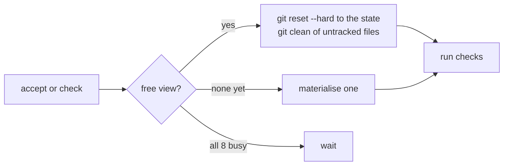

# ADR 10: Verification runs in warm, stable views

Checks run in a reusable workspace at a fixed path, with a private temp directory and a shared cache directory.

**Status:** accepted. Amends [ADR 6](0006-evidence.md). Came out of [Lesson 01](../docs/lessons.mdx).

Amended by [ADR 24](0024-concurrent-checks-see-the-state.md).

## Context

Checks used to run in a new workspace at a random path, deleted afterwards. Real build tools key their caches on absolute paths and file times. On a Rust project every verification therefore recompiled the crate from nothing (about 90 s) and left about 600 MB of build output behind, forever.

Separately, agents running the same test suite at once collided on fixed file names in the shared system temp directory.

## Decision

**Verification views.** Checks run in a workspace at `~/.zit/<repo>/verify/<n>/`. To check a state, the view is moved to it in place:

- Only files that differ between the previous state and this one are rewritten, so file times stay meaningful to incremental builds.
- Files matched by `.gitignore` are kept. That is the build cache.
- Untracked files, and edits a previous check made to tracked files, are removed.
- Each view is locked while in use. Up to eight exist; a ninth verification waits.
- Views are not workspaces: they do not appear in `status`.

**Private temp directory.** Every `zit run` and every check gets `TMPDIR` inside its own workspace directory. It is removed with the workspace, and emptied before each verification.

**Shared cache directory.** `$ZIT_CACHE_DIR` (`~/.zit/<repo>/shared/`) is exported to agents and checks for caches that should outlive workspaces, for example `CARGO_TARGET_DIR="$ZIT_CACHE_DIR/target"`.

## Consequences

- Ten verifications of the experiment's changes kept the build directory at 1.4 GB instead of adding about 6 GB.
- A view is not pristine. An ignored file written by one check is visible to the next. A check that depends on a clean ignored directory must clean it itself.
- Agent workspaces are still created at fresh paths, so each agent still rebuilds a compiled project once. A pool of agent workspaces at stable paths would remove that; it is not built.
- `TMPDIR` isolates temp files. Ports and other machine-wide state remain shared.
