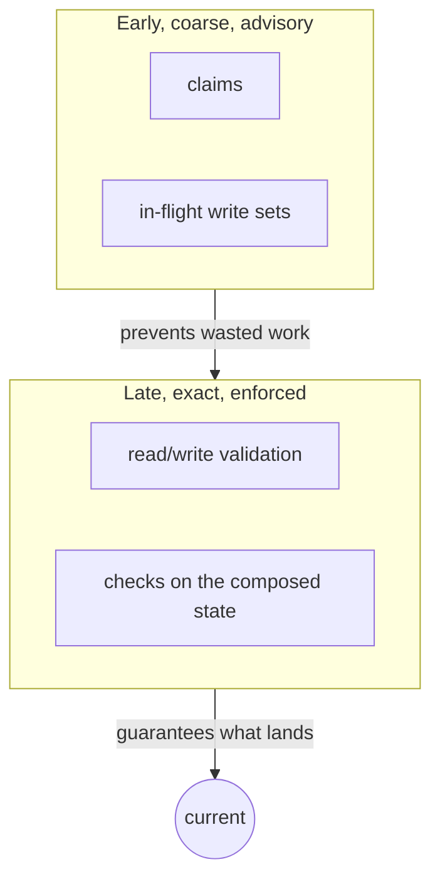

# ADR 11: Claims and in-flight awareness in front of validation

Agents announce what they intend to write and can see what others are writing; validation at accept is unchanged.

**Status:** accepted. Came out of [Lesson 01](../docs/lessons.mdx).

## Context

Validation at accept ([ADR 4](0004-acceptance.md)) is optimistic: it finds conflicts after the work is done. With ten agents on one task, nine results were discarded. Optimistic schemes are known to degrade this way under contention; the standard remedy is to add a cheap, early, pessimistic signal in front of them.

## Decision

Two additions. Neither changes what `accept` does.

**Claims.** `zit claim RESOURCE…` records, on the workspace, what it intends to write.

- A claim is refused if it overlaps anything already **held**. Held means: claimed by another open workspace, being written by another open workspace (whether it claimed or not), or written by a recorded change that is not accepted yet.
- All or nothing, decided under one lock, so of several simultaneous claims exactly one wins.
- A refusal names the holder. Exit code 1.
- Nothing releases a claim. It is a file inside the workspace directory and lapses when the workspace is disposed.

**In-flight write sets.** For every open workspace, `status` and the web view show what it has written so far, at symbol granularity, and where that overlaps other unaccepted work. This is computed on demand by snapshotting the workspace's files into a temporary index; the agent's own git state is not touched.

## Why resources, not task names

A claim on a free-form label ("deps-upgrade") only excludes agents that pick the same words. A claim on `Cargo.toml` excludes everyone who would write `Cargo.toml`, and it uses the same overlap rule as validation.

## Consequences

- Measured on ten agents with one prompt: agent time 4,128 s → 697 s, accepted changes 1 → 5.
- Claims are voluntary. An agent that neither claims nor has started writing is invisible until it writes.
- A claim costs a scan of every open workspace. It runs in parallel but grows with their number.
- Each look at a workspace's in-flight writes stores its current file contents as unreferenced git objects, which git's garbage collection removes.
- Claims are local to the machine. They are not part of the replicated graph.
