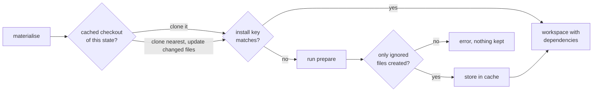

# ADR 14: Install dependencies once, clone them into every workspace

A [prepare] step installs dependencies into the cached checkout; workspaces inherit them by copy-on-write clone.

**Status:** accepted. Amends [ADR 5](0005-materialisation.md). Came out of [Lesson 02](../docs/lessons.mdx).

## Context

Measured on the machine this was built on: 57 linked worktrees use 4.42 GB, of which 3.87 GB (88%) is installed dependencies and build output. Copy-on-write workspaces removed only the source-file part. Lesson 01 had already found the same thing from the other side: every agent workspace started cold and installed or built from nothing.

Zit already keeps a cached checkout of the current state and clones every workspace from it. Anything in that checkout comes along at almost no cost, including ignored directories.

## Decision

```toml zit.toml
[prepare]
run = "npm ci"
inputs = ["package.json", "package-lock.json"]
```



- The install key is the command plus the content address of its `inputs`, computed like an evidence key ([ADR 6](0006-evidence.md)).
- The cached checkout records the key it was prepared with. A workspace whose clone already has the right key skips the step.
- Moving a cached checkout to a new state keeps ignored files, so an unrelated change keeps the install and a lockfile change reinstalls.
- An install may only create files that are ignored. If it rewrites a tracked file or leaves an unignored one, materialisation fails and names the files. An install can therefore never end up in a change.
- It runs with `TMPDIR` and `ZIT_CACHE_DIR` set, like checks.

## Consequences

- 5 contributors, 206 MB of dependencies (`bench/space.sh`): 1,619 MB and 10.2 s with worktrees, 327 MB and 1.5 s with Zit.
- The first workspace after an inputs change pays for one install; the rest clone it.
- Use an install that does not rewrite the lockfile (`npm ci`, not `npm install`).
- Without a copy-on-write file system the install still runs, but once per workspace.
- Build tools that key caches on absolute paths may still rebuild the project's own code in each workspace. Not measured.
