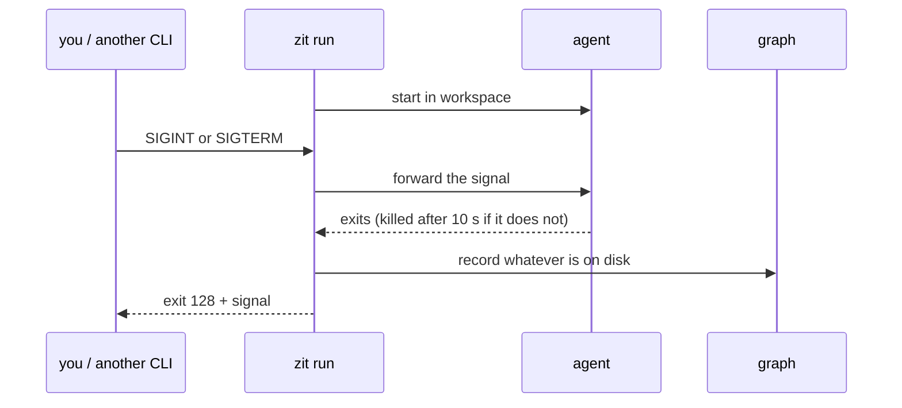

Two ways in. `zit run` was run against the real CLIs on the machine this was built on: autohand 0.9.9-alpha, Claude Code 2.1.288, codex-cli 0.159.2. The Pi preset (pi 0.84.4) is tested for its command line; its live run stopped at Pi's own provider login ("API key expired"), so it has not yet recorded a change end to end.

| | `zit run` | `zit mcp` |
|---|---|---|
| The agent needs to know about Zit | no | yes, through tools |
| Agent's working directory | the workspace | its own project directory |
| Work is recorded | when the process ends, however it ends | when the agent calls `zit_record` |
| Best for | headless and parallel runs | an interactive session that manages several changes |

## Wrap the process: `zit run`

```sh
zit run --agent autohand --intent "Add a discount function to src/lib.rs"
zit run --agent claude   --intent "Add a discount function to src/lib.rs"
zit run --agent codex    --intent "Add a discount function to src/lib.rs"
zit run --agent pi       --intent "Add a discount function to src/lib.rs"
```

Each creates a workspace on current, runs the agent inside it, records what it left behind as a change, and deletes the workspace. Your checkout is never touched.

With no command after `--`, these presets are used, with `--intent` as the prompt:

| `--agent` | Command |
|---|---|
| `autohand` | `autohand -p <intent> --yes --output-format stream-json` |
| `claude` | `claude -p <intent> --permission-mode acceptEdits --output-format json` |
| `codex` | `codex exec --json --sandbox workspace-write --output-last-message $ZIT_SUMMARY_FILE --add-dir ~/.zit/<repo>-<hash> <intent>` |
| `pi` | `pi -p <intent>` |

The first three run in the agent's JSON mode. `zit run` reads the agent's final message and what the turn cost from that output and prints the final message when the agent is done, instead of the raw events. The same happens when you give such a command yourself (`-- claude -p … --output-format json`).

Anything else: give the command yourself.

```sh
zit run --agent my-bot --intent "Fix the flaky test" -- my-bot --task fix-flaky
```

| Flag | Effect |
|---|---|
| `--from CHANGE` | start from a change other than current |
| `--accept` | accept the recorded change, unless the agent was interrupted or timed out |
| `--timeout SECONDS` | stop the agent after this long; its partial work is still recorded; exit code 124 |
| `--keep` | leave the workspace in place |
| `--json` | print a report; the agent's stdout goes to stderr |

### What it cost

`zit run` records what the agent reports about its own usage with the change, and `zit show` prints it:

```text
usage    34012 tokens in, 1840 out, $0.1865
```

| Agent | Reports |
|---|---|
| Claude Code | tokens in (cached ones included) and out, and dollars |
| Codex | tokens in and out, summed over its turns; no price |
| Autohand Code, Pi | nothing yet |

The numbers are the agent's own; Zit adds nothing. They are stored as `Zit-Tokens` and `Zit-Cost-USD` trailers, so `git log` keeps them too.

### What the agent says is kept

Agents end a session by saying what they did and why. `zit run` keeps that with the change: it passes the agent's output through to you as usual and stores the end of it, the last 8,000 bytes, with colour codes removed. An agent can instead write its account to `$ZIT_SUMMARY_FILE`, which takes precedence; the `codex` preset does this with `--output-last-message`. The account is the body of the change's commit message, so `zit show`, the [web view](/web) and `git log` all show it.

The agent's environment:

| Variable | Value |
|---|---|
| `ZIT_WORKSPACE` | its workspace id, so `zit claim`, `zit read` and `zit record` need no `--workspace` |
| `TMPDIR` | a temp directory of its own, deleted with the workspace |
| `ZIT_SUMMARY_FILE` | where it may write its account of the work |
| `ZIT_CACHE_DIR` | a directory shared by every agent and check of this repository, for build caches |

## Many agents, one task

Agents given the same task will do the same work unless they can see each other. Ten agents with one prompt produced one accepted change and nine rejected ones; with the four lines below added to the prompt, five accepted and one rejected, in a sixth of the agent time ([Lessons](/lessons)).

```text
You are one of several agents given this same task at the same time, coordinated through zit.
- Before you edit any file, claim it: `zit claim <path>...`. To claim part of a file use
  `path#Symbol` for code or `path#Section heading` for Markdown.
- If a claim is refused, another agent is already doing that part. Do not duplicate it.
  Pick a different part of the task that nobody holds, or stop if nothing useful is left.
- `zit status` shows what the others have claimed and are writing.
```

Measured with 20 git developers and 30 agents on one repository: with these rules, 46 of 50 contributors landed their work and 3 correctly stopped because someone else had already done their task ([Lessons](/lessons)).

The agent needs permission to run `zit claim` and `zit status`. With Claude Code: `--allowedTools "Bash(zit claim:*)" "Bash(zit status:*)"`.

A claim is refused when the resource is claimed by another open workspace, is being written by one, or was written by a change that is not accepted yet. What open workspaces are writing is recomputed at most every 2 seconds, so a claim may be decided on a picture up to 2 seconds old. Generated files declared in `zit.toml` are never held: claiming one blocks no one, because they are rebuilt on compose; they are rebuilt on compose. Claims prevent wasted work; they guarantee nothing. What lands is still decided at `accept` (ADR 11).

### Stopping an agent



The work is in the graph before `zit run` returns. Once it is recorded, a further signal stops Zit itself (for example during the checks of `--accept`). At a terminal, Ctrl-C reaches the agent directly; Zit only forwards it if the agent is still running a second later, so the agent never sees it twice in a row.

If Zit itself is killed with `SIGKILL`, the workspace remains. `zit status` lists it as `owner gone`; `zit record --workspace <id>` salvages it.

## Autohand Code: `autohand --zit`

Autohand Code can run a whole session, interactive or `-p`, in a Zit workspace instead of a git worktree:

```sh
autohand --zit "Add a Usage section to README.md"
autohand --zit -p "Add a short Usage section to README.md" --yes
```

It runs `zit init` if the repository has none, materialises a workspace, and works there. Before each write, its file tools ask Zit what the edit would change (`zit claim --edit`) and claim only that: the functions, types, methods or Markdown sections the edit touches, or the whole file for a new file. If another agent holds any of it, the tool writes nothing and tells the model who holds it, so the model picks other work or stops. Edits made through the shell are covered only by the instruction to run `zit claim` first; sub-agents that start their own runtime, and writes outside the workspace, are not claimed. When the session ends (normally, on Ctrl-C, or after an error) records the workspace as a change with the model's final message as its reason. `--zit` cannot be combined with `--worktree` or `--tmux`. It finds `zit` on `PATH` or through `ZIT_BIN`.

Run end to end with a compiled build: a real model turn recorded a change with its reason, and the original checkout was untouched. With two sessions started on the same file, the second was refused at its write tool, wrote nothing and stopped. It is on Autohand Code's `zit-sessions` branch and not in a released version yet.

## Give the agent tools: `zit mcp`

`zit mcp` is a stdio MCP server. Start the agent in the repository; the tools act on the repository containing the server's working directory.

An agent gets every tool except `zit_accept` and `zit_discard`: it can do and record work, not land it or remove someone else's. An integrator agent, one you deliberately let move current, is started with `zit mcp --integrator`.

**Autohand Code**

```json zit.mcp.json
{ "mcpServers": { "zit": { "command": "zit", "args": ["mcp"] } } }
```

```sh
autohand --mcp-config zit.mcp.json
```

**Claude Code**

```sh
claude --mcp-config zit.mcp.json
```

Same file as for Autohand Code.

In headless mode, tools must be allowed by name: `--allowedTools mcp__zit__zit_status,…`.

**Codex**

Codex runs commands in a sandbox that can only write inside its working directory and temporary directories. `zit claim` writes under `~/.zit`, so give Codex that directory too: `codex exec --sandbox workspace-write --add-dir ~/.zit …`. Without it, claims from inside Codex fail.

```toml ~/.codex/config.toml
[mcp_servers.zit]
command = "zit"
args = ["mcp"]

# `codex exec` never prompts, so each tool it may call needs approving here.
[mcp_servers.zit.tools.zit_status]
approval_mode = "approve"
```

Verified with the same keys passed as `-c` overrides to `codex exec`. Without the `approval_mode` entry, `codex exec` answers "the tool requires approval, but approval policy is never".

**Pi**

The Pi extension in [`integrations/pi`](https://github.com/autohandai/getzit/tree/main/integrations/pi) gives Pi the same workflow natively: `/zit <intent>` (or `pi --zit "<intent>"`) moves the session into a fresh workspace, the model gets `zit_claim`, `zit_status` and `zit_record` tools and the claim rules in its system prompt, and quitting records the work with Pi's last reply as its reason.

```sh
pi install /path/to/getzit/integrations/pi      # npm:pi-zit once it is published
```

Tested with Pi 0.84.4 and the real `zit` binary (17 tests, and the commands driven through Pi's RPC mode); a turn with a live model has not been run yet.

### Tools

| Tool | Does |
|---|---|
| `zit_materialise` | workspace on a state; returns its `path` |
| `zit_claim` | claim what you intend to write; a refusal names the holder |
| `zit_read` | declare observed resources |
| `zit_record` | snapshot a workspace into a change; returns what it wrote |
| `zit_status` | current, speculative changes, workspaces |
| `zit_show` | one change in full |
| `zit_check` | run a change's checks |
| `zit_accept` | accept, or get the exact reason for rejection (`--integrator` only) |
| `zit_retry` | workspace on current with a rejected change's edits applied |
| `zit_discard` | remove a speculative change (`--integrator` only) |
| `zit_dispose` | delete a workspace |

The agent name recorded on a change defaults to the MCP client's own name.

## Things to know

- **Agent state files.** Autohand's and Claude Code's session state (`.autohand/memory/`, `.autohand/*.local.json`, `.autohand/session-permissions.json`, `.claude/settings.local.json`) is never recorded. Other agents' state files are; add them to `ignore` in `zit.toml`.
- **MCP workspaces are outside the project directory** (under `~/.zit`). Whether the agent may write there is up to the agent's permission settings.
- **Reads are not tracked automatically.** Zit infers them from the code a change wrote. An agent that relied on something it did not reference in code should declare it with `zit_read` or `zit read`.
