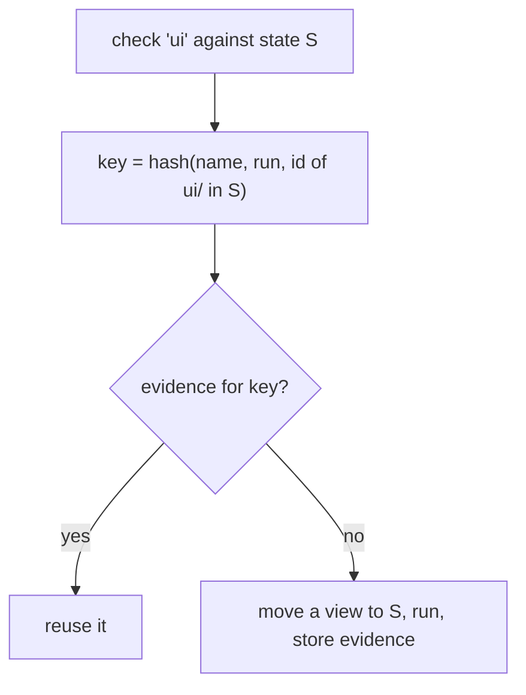

## Declare

`zit.toml` at the repository root, committed like any other file:

```toml
[[check]]
name = "api"
run = "cargo test -p api"
inputs = ["crates/api", "Cargo.lock"]

[[check]]
name = "ui"
run = "npm test --prefix ui"
inputs = ["ui"]

[[check]]
name = "lint"
run = "./scripts/lint.sh"        # no inputs: depends on the whole state
```

| Field | Meaning |
|---|---|
| `name` | identifies the check in output and in the key |
| `run` | shell command, executed with `sh -c` at the root of a view of the state |
| `inputs` | paths the result depends on; omitted means everything |
| `timeout` | seconds before the check, and everything it started, is stopped and counted as failed; default 1800 |

Exit code 0 is a pass. The command's environment:

| Variable | Value |
|---|---|
| `ZIT_CHANGE`, `ZIT_STATE` | what is being checked |
| `TMPDIR` | a temp directory of its own, emptied before each verification (not between the checks of one verification) |
| `ZIT_CACHE_DIR` | a directory that outlives workspaces, shared with agents |

## Where checks run

In a **verification view**: a directory at a stable path that is moved from state to state in place. Files that did not change keep their timestamps and files matched by `.gitignore` are kept, so incremental build tools stay warm; anything untracked is removed. On the Rust project in [Lessons](/lessons) this is the difference between recompiling everything for every accept and not.

A check that needs a clean build directory must clean it itself.

## Run

```sh
zit check <change>           # run what has no evidence yet
zit check <change> --rerun   # ignore existing evidence
```

`zit accept` runs the same thing against the state that is about to become current, so you rarely call `check` yourself.

## Reuse



The id of `ui/` is a git tree id: a hash of every file under it. A change that touches only `crates/api` leaves that id, and therefore the `ui` key, unchanged.

Failures are stored too: a known-failing state is rejected without re-running. For a flaky check, `zit check --rerun` or `zit accept --rerun` runs everything again.

## Limits

- **A change cannot weaken its own gate.** `accept` runs the checks declared by current *and* those declared by the change. A change that rewrites `run = "cargo test"` as `run = "true"` still has to pass `cargo test`. It can add checks, not remove them.
- **`zit.toml` is still code.** Every `run`, `derive` and `prepare` command executes with your privileges. A change's own new checks and `[[derive]]` commands run when you check or accept it, and its `[prepare]` runs when anyone materialises it (`--from`) and when it is checked or accepted (in a verification view). A change that edits `zit.toml` shows it in its write set; read it before accepting or building on it.
- **A check that times out or is killed is not remembered.** Its result is reported but not stored as evidence, so the next accept runs it again instead of trusting a failure the code did not cause.

- `inputs` is trusted. If a check reads files it did not declare, it can be reused when it should not be.
- Ignored files persist in a view from one check to the next (ADR 10).
- The checks of one verification run one after another. Up to eight verifications run at once.

## Generated files

A file that a script builds from other files (a registry, an index, a bundle manifest) is not something two contributors can meaningfully conflict on. Declare it:

```toml
[[derive]]
path = "registry.json"
run = "python3 scripts/generate_registry.py"
```

Writes to `path` never make a change stale, conflicts inside it do not count, and claims on it never block anyone. When a change is composed onto current, `run` is executed on the composed state and its output for `path` is what lands. A failing `run` rejects the change: `rejected: failed checks: derive registry.json`. (ADR 12)

## Dependencies

```toml
[prepare]
run = "npm ci"
inputs = ["package.json", "package-lock.json"]
```

Run once in the cached checkout every workspace is cloned from, and again only when `inputs` change. Every workspace starts with the result, as a copy-on-write clone. It may only create ignored files; anything else is an error that names the files. Use an install that does not rewrite the lockfile. (ADR 14)

## How changes land

```toml
[accept]
linear = true   # compose as one commit on top of current, never a merge commit
```

Read from current, so it applies to everyone who accepts. Same as `zit accept --linear` ([Teams and review](/git#teams-and-review)).

## Ignore patterns

```toml
ignore = ["agent-notes/", "*.log"]
```

Files agents and tools leave behind that should never be part of a change, in gitignore syntax. Added to your own global excludes and to built-in patterns for files that are never source: `.DS_Store`, `__pycache__/`, `*.py[cod]`, `.pytest_cache/`, `.mypy_cache/`, `.ruff_cache/`, `*.swp`, and coding agents' session state (`.autohand/memory/`, `.autohand/*.local.json`, `.autohand/session-permissions.json`, `.claude/settings.local.json`). Tracked files are never hidden. (ADR 13)

## A complete example

```toml zit.toml
ignore = [".coverage"]

[prepare]
run = "npm ci"
inputs = ["package.json", "package-lock.json"]

[[derive]]
path = "registry.json"
run = "node scripts/build-registry.js"

[[check]]
name = "unit"
run = "npm test"
inputs = ["src", "test", "package.json", "package-lock.json"]

[[check]]
name = "types"
run = "npx tsc --noEmit"
inputs = ["src", "tsconfig.json"]
```
