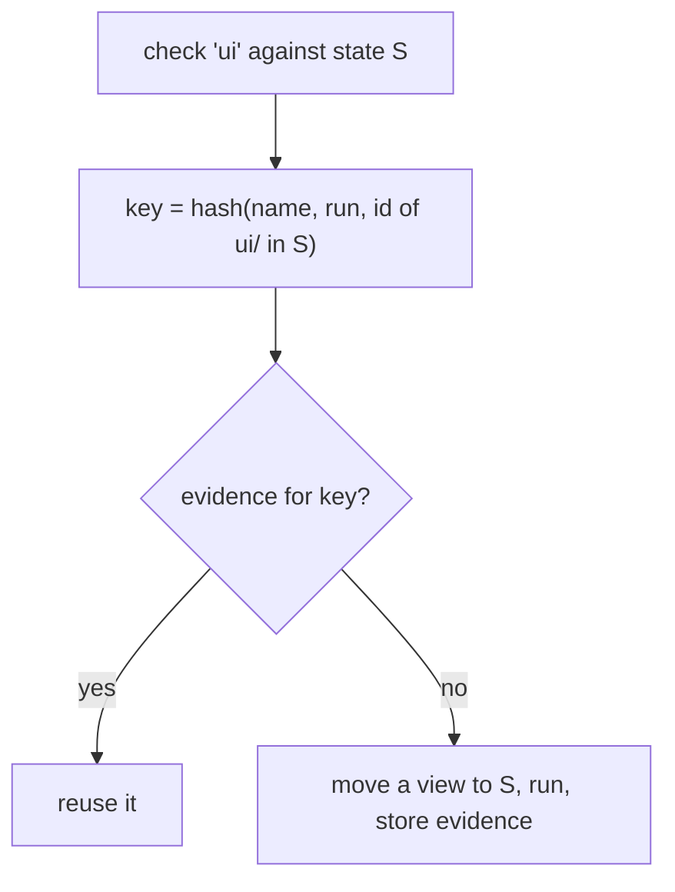

## Declare

`zit.toml` at the repository root, committed like any other file:

```toml
[[check]]
name = "api"
run = "cargo test -p api"
inputs = ["crates/api", "Cargo.lock"]

[[check]]
name = "ui"
run = "npm test --prefix ui"
inputs = ["ui"]

[[check]]
name = "lint"
run = "./scripts/lint.sh"        # no inputs: depends on the whole state
```

| Field | Meaning |
|---|---|
| `name` | identifies the check in output and in the key |
| `run` | shell command, executed with `sh -c` at the root of a view of the state |
| `inputs` | paths the result depends on; omitted means everything |
| `timeout` | seconds before the check, and everything it started, is stopped and counted as failed; default 1800 |
| `serial` | `true` runs this check alone, whatever `[accept] jobs` allows; default `false` |

`inputs` are paths, not patterns. `src/*.rs` would match nothing in the tree and its evidence would be reused forever, so it is refused: `zit.toml: input `src/*.rs` is a pattern; inputs are paths`. Name the directory instead: `src`.

Exit code 0 is a pass. The command's environment:

| Variable | Value |
|---|---|
| `ZIT_CHANGE`, `ZIT_STATE` | what is being checked |
| `TMPDIR` | a temp directory of its own, emptied before each verification (not between the checks of one verification) |
| `ZIT_CACHE_DIR` | a directory that outlives workspaces, shared with agents |
| `ZIT_PORT` | a free TCP port chosen for this view, as for workspaces ([Agents](/agents#wrap-the-process-zit-run)); not reserved |

## Where checks run

In a **verification view**: a directory at a stable path that is moved from state to state in place. Files that did not change keep their timestamps and files matched by `.gitignore` are kept, so incremental build tools stay warm; anything untracked is removed. On the Rust project in [Lessons](/lessons) this is the difference between recompiling everything for every accept and not.

A check that needs a clean build directory must clean it itself.

Every check of one verification sees the state, not what an earlier check wrote: before each check after the first, the view is restored (`git reset --hard`, `git clean -fd`; ignored files kept). Two git calls per extra check. With `[accept] jobs` above 1 the checks that run at the same time share the view, so a check that writes tracked files needs `serial = true`.

## Run

```sh
zit check <change>           # run what has no evidence yet
zit check <change> --rerun   # ignore existing evidence
zit check <change> --only ui # just this check (repeatable); an unknown name is an error
```

`zit accept` runs the same thing against the state that is about to become current, so you rarely call `check` yourself. `zit accept --dry-run <change>` names the checks an accept would run and those it would reuse, without running anything ([CLI](/cli#zit-accept---dry-run)).

## Reuse



The id of `ui/` is a git tree id: a hash of every file under it. A change that touches only `crates/api` leaves that id, and therefore the `ui` key, unchanged.

Failures are stored too: a known-failing state is rejected without re-running. For a flaky check, `zit check --rerun` or `zit accept --rerun` runs everything again.

## Limits

- **A change cannot weaken its own gate.** `accept` runs the checks declared by current *and* those declared by the change. A change that rewrites `run = "cargo test"` as `run = "true"` still has to pass `cargo test`. It can add checks, not remove them.
- **`zit.toml` is still code.** Every `run`, `derive` and `prepare` command executes with your privileges. A change's own new checks and `[[derive]]` commands run when you check or accept it, and its `[prepare]` runs when anyone materialises it (`--from`) and when it is checked or accepted (in a verification view). A change that edits `zit.toml` shows it in its write set; read it before accepting or building on it.
- **A check that times out or is killed is not remembered.** Its result is reported but not stored as evidence, so the next accept runs it again instead of trusting a failure the code did not cause.

- `inputs` is trusted. If a check reads files it did not declare, it can be reused when it should not be.
- Ignored files persist in a view from one check to the next (ADR 10).
- The checks of one verification run one after another unless `[accept] jobs` says otherwise (below). Up to eight verifications run at once.

## The parse check

After `git merge-tree` composes a change onto current, every file both sides changed since their merge base, in a language Zit has a grammar for, is parsed in three versions: current's, the change's, and the merged text. Merged text with syntax errors that neither side had is refused:

```text
rejected: does not parse after composing: src/lib.rs
```

JSON: `{"outcome": "rejected", "reason": "error", "detail": "does not parse after composing: src/lib.rs"}`. Files are parsed whole. It applies to `accept`, `--batch`, `--dry-run` and `--allow-stale`, not to `status`. It is on by default; current's `zit.toml` turns it off:

```toml
[accept]
parse_check = false
```

## Running checks at once

```toml
[accept]
jobs = 2            # default 1

[[check]]
name = "fmt"
run = "cargo fmt --check"
serial = true       # runs alone
```

Up to `jobs` checks of one verification run at the same time, in the same view, started in declared order. Verdict order and evidence keys are unchanged; `jobs` is not part of a key. Concurrent checks share the view directory and `$TMPDIR`, so a check that writes into the tree needs `serial = true`. Measured with two `sleep 1` checks on this Mac: 2.45 s sequential, 1.19 s with `jobs = 2`.

## Free space

Before building any workspace (materialise, retry, run, the cached checkouts) and every verification view, Zit checks the free space on the volume holding its home:

```text
zit: refusing to materialise: <N> MB free on the volume holding <home>, less than zit.minFreeMB = 512 (`git config zit.minFreeMB 0` disables this guard)
```

The threshold is `git config zit.minFreeMB`, default 512; 0 or a negative value disables it. The default has no test that exercises it. A full disk is what lost three agents' work in Lesson 02 ([Lessons](/lessons)).

## Generated files

A file that a script builds from other files (a registry, an index, a bundle manifest) is not something two contributors can meaningfully conflict on. Declare it:

```toml
[[derive]]
path = "registry.json"
run = "python3 scripts/generate_registry.py"
```

Writes to `path` never make a change stale, conflicts inside it do not count, and claims on it never block anyone. When a change is composed onto current, `run` is executed on the composed state and its output for `path` is what lands. A failing `run` rejects the change: `rejected: failed checks: derive registry.json`. (ADR 12)

## Dependencies

```toml
[prepare]
run = "npm ci"
inputs = ["package.json", "package-lock.json"]
```

Run once in the cached checkout every workspace is cloned from, and again only when `inputs` change. Every workspace starts with the result, as a copy-on-write clone. It may only create ignored files; anything else is an error that names the files. Use an install that does not rewrite the lockfile. (ADR 14)

## How changes land

```toml
[accept]
linear = true        # compose as one commit on top of current, never a merge commit
parse_check = true   # refuse a composed state whose files no longer parse (default)
jobs = 1             # checks of one verification that may run at once (default)
```

Read from current, so it applies to everyone who accepts. `linear` is the same as `zit accept --linear` ([Teams and review](/git#teams-and-review)).

## Stable workspace paths

```toml
[workspace]
stable_paths = true
```

or, for one machine, `git config zit.stablePaths true`. Workspaces are then made in numbered slots, `<home>/ws/slot-N`, with `slot-N` as the workspace id; the lowest free slot is taken. Disposing a slot keeps its `tree/` and `git/` (its `meta.json` becomes `retired.json`); the next workspace made there is a `git reset --hard` plus `git clean -fd`: tracked files reset, untracked removed, ignored files kept. Build tools that key their caches on the absolute path (Cargo, for example) then find their output from the last agent at that path.

The trade-off: agents inherit the previous agent's ignored files, stale caches included; a slot whose `[prepare]` key differs from the new state's is rebuilt; slots grow to the peak number of concurrent workspaces and stay until `zit clean`, which removes them all. `[workspace]` is read from the state being materialised.

## Ignore patterns

```toml
ignore = ["agent-notes/", "*.log"]
```

Files agents and tools leave behind that should never be part of a change, in gitignore syntax. Added to your own global excludes and to built-in patterns for files that are never source: `.DS_Store`, `__pycache__/`, `*.py[cod]`, `.pytest_cache/`, `.mypy_cache/`, `.ruff_cache/`, `*.swp`, and coding agents' session state (`.autohand/memory/`, `.autohand/*.local.json`, `.autohand/session-permissions.json`, `.claude/settings.local.json`). Tracked files are never hidden. (ADR 13)

## A complete example

```toml zit.toml
ignore = [".coverage"]

[prepare]
run = "npm ci"
inputs = ["package.json", "package-lock.json"]

[[derive]]
path = "registry.json"
run = "node scripts/build-registry.js"

[[check]]
name = "unit"
run = "npm test"
inputs = ["src", "test", "package.json", "package-lock.json"]

[[check]]
name = "types"
run = "npx tsc --noEmit"
inputs = ["src", "tsconfig.json"]
```
