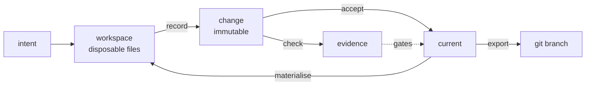
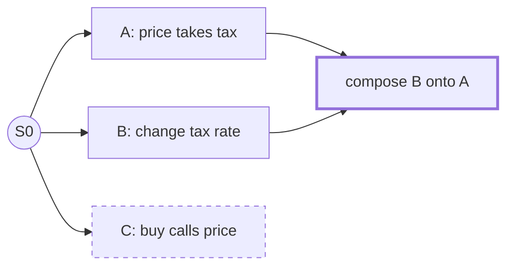
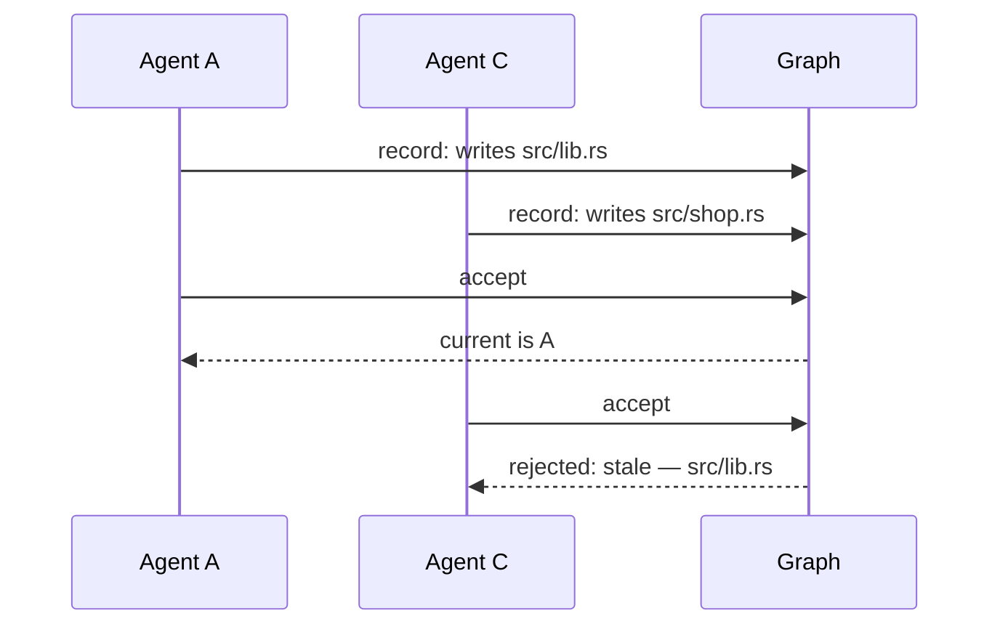
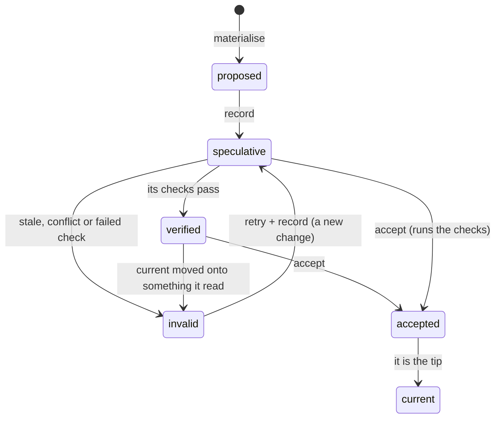

Everything is one of six things. Each maps onto something git already stores.

| Primitive | What it is | Stored as |
|---|---|---|
| **State** | the whole program at one instant, immutable | a git tree; its id is the content hash |
| **Change** | a transition to a state, with intent and provenance | a git commit under `refs/zit/changes/` |
| **Causality** | which changes a change builds on | the commit's parents |
| **Materialisation** | a state as files an agent can edit | a disposable directory, never the source of truth |
| **Evidence** | the result of a check against a state | a blob under `refs/zit/evidence/` |
| **Acceptance** | choosing which change is the program now | moving `refs/zit/current` |



## State

A state is a git tree. Two workspaces with identical files have the same state id, whoever made them. A state does not need to be a commit on a branch, and most never are.

## Change

A change is an immutable record: *from these parents, with this intent, by this agent, to this state*.

```text
Raise the price

Zit-Agent: claude
Zit-Session: 4f1c…
Zit-Read: src/shop.rs
```

What a change **wrote** is never declared. It is computed from the difference between its state and its parent's, at symbol granularity: `src/lib.rs#price`, not "src/lib.rs changed".

What a change **read** comes from two places: identifiers mentioned in the symbols it wrote (inferred), and resources the agent declared.

## Causality: no branches, no merge command

Changes form a graph through their parents. There is no branch object. Starting from any change is just another child of it.



A and B were made concurrently and touch different symbols, so accepting B after A creates a compose change with both as parents. C called `price` with the old signature; it stays in the graph, marked stale, and is never merged by accident.

## Staleness

A speculative change is **stale** when, since the point where it and current diverged, current wrote something the change read or wrote, or the change wrote something current read. A read inferred from a name counts only when the symbol's interface changed; a declared read counts for any change. Concurrent writes to Markdown sections and to imports are left to the text merge, and generated files never count.



Git would merge those two changes without complaint: they touch different files. The graph knows why C is stale, names the symbol and the change that wrote it, and keeps C intact for `zit retry`.

## Status

Status is computed, never stored (ADR 2).



`proposed` is a workspace that has not been recorded. The others are what `zit status` prints.

## Materialisation

`zit materialise` gives a directory holding a state. The agent may do anything to it, including delete it. Recorded changes do not live there.

On a copy-on-write file system (APFS on macOS; btrfs or XFS with reflink on Linux) the directory is a clone of a cached checkout, so creating one does not copy file contents (ADR 5). It is also a working git view, without being a registered worktree and without a branch.

## Claims: before the work, not after

Validation happens at the end. For agents sharing a task that is too late: the work is already done twice. `zit claim src/server.rs` announces what a workspace intends to write, and is refused if other unaccepted work already holds it. `zit status` shows what every open workspace is writing right now.

Claims save work. They decide nothing: what lands is still settled by `accept` (ADR 11).

## Evidence

A check result is stored under a key made of the check and the content of its declared inputs. If a later state has the same inputs, the result is reused instead of re-run ([Checks](/checks)).

## Acceptance

`zit accept` is the only thing that moves current. It composes if needed, verifies the composed state, and moves current atomically. A rejected change is left exactly as it was (ADR 4).
