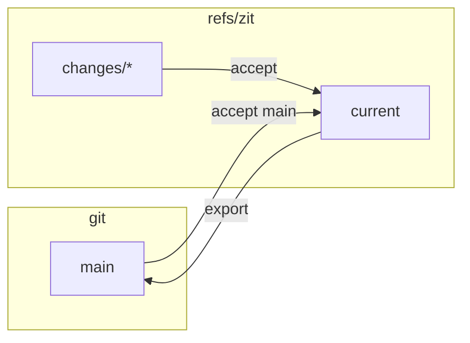

## A git extension

`cargo install` puts `git-zit` next to `zit`, so every command is also `git zit …`. Teammates who never install Zit keep working exactly as before: branches, pull requests, `git push`. Their pushed branches are accepted with `git zit accept origin/<branch>`.

## What Zit adds to a repository

Refs under `refs/zit/`, and the objects they point to. Nothing else.

| Ref | Points to |
|---|---|
| `refs/zit/current` | the accepted change (a commit) |
| `refs/zit/changes/<id>` | a speculative change (a commit) |
| `refs/zit/evidence/<key>` | an evidence record (a blob) |

It does not create branches, register worktrees, or touch your checkout — except `export`/`sync` to a branch you have checked out, which fast-forwards its files.

## In: any commit is a change

```sh
git commit -am "Human edit"
zit accept main        # or any revision
```

If current has moved since, the commit is composed onto it under the same rules as any agent's change.

## Out: export

```sh
zit export --branch main
```

Fast-forward only. If the branch has commits current lacks, export refuses and tells you to accept the branch first.

`zit sync --branch main` does both: accepts the branch into current, then fast-forwards the branch to current.



## Another machine

The graph is refs, so git moves it:

```sh
git fetch origin 'refs/zit/*:refs/zit/*'          # changes, current, evidence
git push  origin 'refs/zit/*:refs/zit/*'
```

After a fetch the other machine sees the same speculative changes and evidence, and can materialise any of them. This is tested end to end in `tests/replicate.rs`.

- **Do not add `--prune` to the push.** It deletes every remote change you have not fetched, which can be someone else's work.
- **One integrator.** There is no reconciliation for the refs themselves: if two machines both move `refs/zit/current`, the second push is refused as non-fast-forward. Run `accept` in one place (one machine, or one CI job) per repository.
- **Fetched evidence is trusted.** A check result fetched from a remote is reused like one produced locally, and nothing records who produced it. Anyone who can push `refs/zit/*` can therefore plant a passing result. Until evidence is signed, accept with `--rerun` when the evidence came from elsewhere, or do not fetch `refs/zit/evidence/*`.

## Teams and review

Zit decides whether a change *can* land: it composes, checks and explains it. It does not decide whether a person has *approved* it.

- **Protected `main`.** Export to a branch you are allowed to push, and open a pull request from it: `zit export --branch zit/ready && git push origin zit/ready`. Your code host's required reviews, CODEOWNERS and status checks then apply as usual. The pull request carries each change's account in its commits.
- **Required checks in CI.** Zit's checks run on the integrator's machine, in a reused build directory: fast, not hermetic. Keep CI as the authority; Zit's checks are the pre-filter that keeps broken combinations out of the queue.
- **History shape.** A change accepted onto a moved current becomes a two-parent "Compose" commit, so `main` gets one merge per change. There is no squash or rebase mode yet.
- **Identity and signing.** The author of a change is its agent name, which the agent can choose; compose commits are not signed. Repositories that require signed commits on `main` need the pull-request route above.

## Inspecting with git

Changes are commits:

```sh
git log --graph refs/zit/current
git show <change>
git diff refs/zit/current <change>
```
