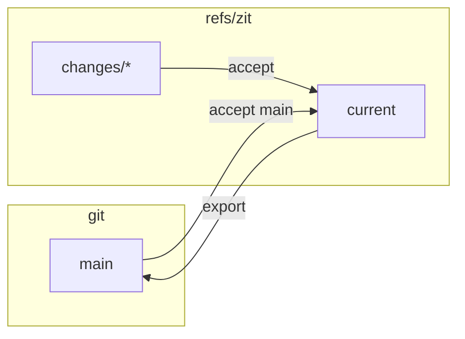

## A git extension

`cargo install` puts `git-zit` next to `zit`, so every command is also `git zit …`. Teammates who never install Zit keep working exactly as before: branches, pull requests, `git push`. Their pushed branches are accepted with `git zit accept origin/<branch>`.

## What Zit adds to a repository

Refs under `refs/zit/`, the objects they point to, and a local ledger in `.git/zit/` that is never pushed.

| Ref | Points to |
|---|---|
| `refs/zit/current` | the accepted change (a commit) |
| `refs/zit/changes/<id>` | a speculative change (a commit) |
| `refs/zit/evidence/<key>` | an evidence record (a blob) |
| `refs/zit/logs/<id>` | the agent output kept by `zit run --log` (a blob) |

It creates or moves a branch only when you `export` or `sync` to it, register worktrees, or touch your checkout — except `export`/`sync` to a branch you have checked out, which fast-forwards its files.

## In: any commit is a change

```sh
git commit -am "Human edit"
zit accept main        # or any revision
```

If current has moved since, the commit is composed onto it under the same rules as any agent's change.

## Out: export

```sh
zit export --branch main
```

Fast-forward only. If the branch has commits current lacks, export refuses and tells you to accept the branch first.

`zit sync --branch main` does both: accepts the branch into current, then fast-forwards the branch to current.



## Another machine

The graph is refs, so git moves it:

```sh
git fetch origin 'refs/zit/*:refs/zit/*'          # changes, current, evidence
git push  origin 'refs/zit/*:refs/zit/*'
```

After a fetch the other machine sees the same speculative changes and evidence, and can materialise any of them. This is tested end to end in `tests/replicate.rs`.

- **Do not add `--prune` to the push.** It deletes every remote change you have not fetched, which can be someone else's work.
- **One integrator.** There is no reconciliation for the refs themselves: if two machines both move `refs/zit/current`, the second push is refused as non-fast-forward. Run `accept` in one place (one machine, or one CI job) per repository.
- **Fetched evidence is not trusted by default.** Anyone who can push `refs/zit/*` could write a passing result, so each clone remembers which results it produced itself (in `.git/zit/`) and runs the rest again. A machine that should trust another, for example your CI, says so: `git config zit.trustFetchedEvidence true`. Tested in `tests/replicate.rs`, including a forged result that does not get a failing change accepted.
- **When two machines disagree about a result**, the second push of that evidence ref is refused. Publish your result deliberately with `git push origin '+refs/zit/evidence/*:refs/zit/evidence/*'`.

## Teams and review

Zit decides whether a change *can* land: it composes, checks and explains it. It does not decide whether a person has *approved* it; your code host does.

### Protected `main`: a pull request

```sh
zit export --branch zit/ready --pr            # --base main --remote origin are the defaults
```

This fast-forwards `zit/ready` to current, pushes it, and opens a pull request into `main` with the GitHub CLI (`gh`). The title is the change's intent (or "N changes"); the body lists every change with its author's reason. Branch protection, required reviews, CODEOWNERS, status checks and the merge queue then apply as usual. Tested in `tests/teams.rs` (with a stand-in for `gh`).

### Linear history

```sh
zit accept --linear <change>
```

or, for everyone, in `zit.toml`:

```toml
[accept]
linear = true
```

A change accepted onto a moved current then becomes one commit on top of it, not a merge commit; it carries a `Zit-Change:` trailer, so accepting it again is recognised as done. A change built on current is a fast-forward either way.

What a linear compose keeps and what it means for the graph:

- **Accepting the tip of a chain accepts the chain.** With `c1 ← c2` both speculative, `zit accept --linear c2` lands both edits in one commit; the `Zit-Change` trailers on `base..current` mark `c1` as landed too, and the transaction retires every `refs/zit/changes/*` merged into it. Before, `c1` stayed listed as speculative and then stale.
- **Building on a linearly landed change works.** A change made on `c1` after `c1` landed linearly is judged by its own edits: staleness compares what it wrote since `c1` with what current wrote since the commit that landed `c1`, and the text merge uses `c1`'s tree as the base. Git 2.38 has no `merge-tree --merge-base`, so Zit makes three throwaway deterministic commits for that merge.
- **Declared reads are carried.** The compose commit copies the `Zit-Read` trailers of the changes it lands, so a later write to something they declared is still a conflict.

Finding what landed linearly scans `base..current` for trailers; the scan grows with that span.

### Who committed, and signatures

The author of a change is its agent; the committer is you, from git's `user.name` and `user.email`. With `commit.gpgsign` set (any spelling git accepts as true), every commit Zit writes is signed with your key, as git is configured to sign. Tested with an SSH key in `tests/teams.rs`.

### Batches

```sh
zit accept A B C      # these, composed in order, checked once, landed together
zit accept --batch    # every change whose status is verified
```

The checks run once on the combined state and current moves once. A member that is stale, does not merge or does not parse is skipped with its reason and the rest land; a check that fails on the combined state lands nothing, because Zit cannot say which member broke it (`next: accept one at a time`). Each change keeps its own commit and reason in the exported history. Output and JSON on the [CLI reference](/cli#accepting-several-changes).

### CI

Zit's checks run on the integrator's machine, in a reused build directory: fast, not hermetic. Keep CI as the authority; Zit's checks are the pre-filter that keeps broken combinations out of the queue. To integrate in CI instead, run `zit accept` in one job with `zit.trustFetchedEvidence` off, so the job runs every check itself.

#### GitHub Actions

[`integrations/github`](https://github.com/autohandai/getzit/tree/main/integrations/github) is a composite action that makes a job the integrator: it installs a released `zit`, fetches `refs/zit/*` and the branch, accepts every speculative change in the order it was recorded (`zit accept --json`, one at a time), exports to the branch, pushes the branch and the graph back, and deletes the accepted `refs/zit/changes/<id>` on the remote. If `refs/zit/current` has never been pushed, the first run starts the graph at the branch (`zit init --from refs/remotes/<remote>/<branch>`).

```yaml
- uses: autohandai/getzit/integrations/github@main
  id: zit
  with:
    version: latest        # a release, e.g. 0.1.1; the tarball is checked against its SHA-256
    branch: main           # exported and pushed after accepting
    remote: origin
    trust-evidence: "false"
```

| Input | Default | Meaning |
|---|---|---|
| `version` | `latest` | release to install |
| `branch` | `main` | follows current: `zit export --branch` after accepting, then pushed |
| `remote` | `origin` | where `refs/zit/*` is fetched from and pushed to |
| `trust-evidence` | `false` | `true` sets `zit.trustFetchedEvidence`, so evidence pushed with the graph is reused; off, every check runs on the runner |
| `token` | the job's token | only to resolve `latest` through the GitHub API |

Outputs: `accepted` (ids, space-separated), `rejected` (`id:reason`, one of `stale`, `conflict`, `failed`), `current`. The job needs `permissions: contents: write`, `fetch-depth: 0`, and whatever the checks need installed. A rejected change does not fail the job; it stays in the graph for its author to `zit retry`. The job fails only when a step fails (fetch, export, push).

A push to `refs/zit/*` alone starts no workflow: GitHub runs workflows for branches and tags only. The example workflow `zit-integrate.yml` therefore runs on a schedule and by `workflow_dispatch` (`gh workflow run zit-integrate`), with a concurrency group so one integrator runs at a time.

What is tested: `integrate.sh` against a local bare origin (`tests/cli.rs`: a compatible change lands, a stale one stays with its reason, `main` and `refs/zit/current` arrive at origin, the landed change's ref is removed there); `install.sh` run by hand against release 0.1.1 on this Mac. Not tested: the action and workflow on GitHub Actions itself, `install.sh` on Linux or x86_64 macOS, `trust-evidence: true` end to end, the first-run `init` branch. The scripts need git, bash and python3, and read `ZIT`, `ZIT_REMOTE`, `ZIT_BRANCH`, `ZIT_TRUST_EVIDENCE`, `ZIT_VERSION`, `ZIT_DIR`.

## Inspecting with git

Changes are commits:

```sh
git log --graph refs/zit/current
git show <change>
git diff refs/zit/current <change>
```
