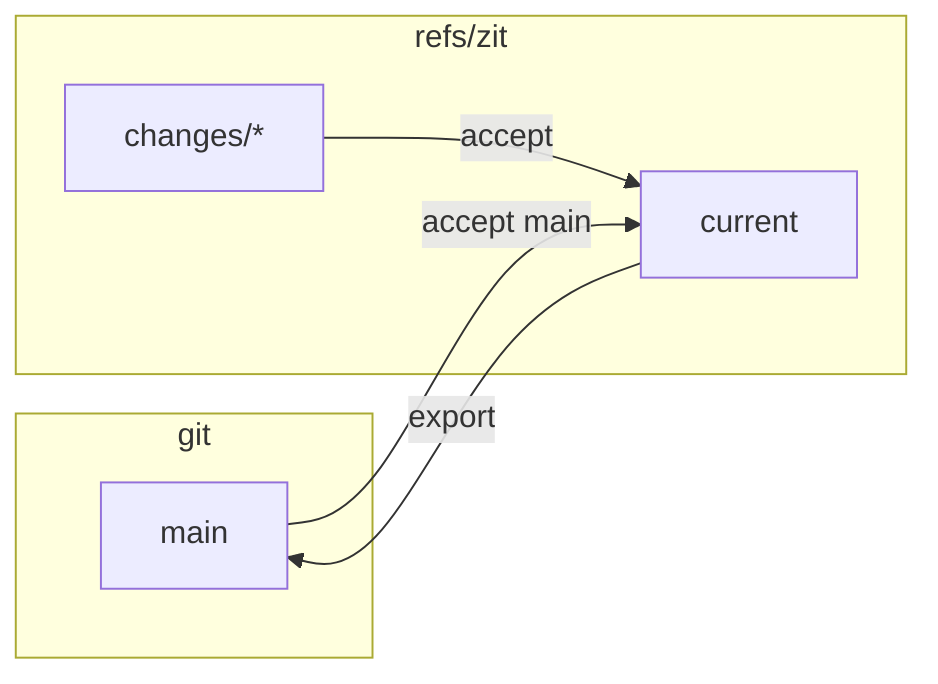

## A git extension

`cargo install` puts `git-zit` next to `zit`, so every command is also `git zit …`. Teammates who never install Zit keep working exactly as before: branches, pull requests, `git push`. Their pushed branches are accepted with `git zit accept origin/<branch>`.

## What Zit adds to a repository

Refs under `refs/zit/`, the objects they point to, and a local ledger in `.git/zit/` that is never pushed.

| Ref | Points to |
|---|---|
| `refs/zit/current` | the accepted change (a commit) |
| `refs/zit/changes/<id>` | a speculative change (a commit) |
| `refs/zit/evidence/<key>` | an evidence record (a blob) |

It creates or moves a branch only when you `export` or `sync` to it, register worktrees, or touch your checkout — except `export`/`sync` to a branch you have checked out, which fast-forwards its files.

## In: any commit is a change

```sh
git commit -am "Human edit"
zit accept main        # or any revision
```

If current has moved since, the commit is composed onto it under the same rules as any agent's change.

## Out: export

```sh
zit export --branch main
```

Fast-forward only. If the branch has commits current lacks, export refuses and tells you to accept the branch first.

`zit sync --branch main` does both: accepts the branch into current, then fast-forwards the branch to current.



## Another machine

The graph is refs, so git moves it:

```sh
git fetch origin 'refs/zit/*:refs/zit/*'          # changes, current, evidence
git push  origin 'refs/zit/*:refs/zit/*'
```

After a fetch the other machine sees the same speculative changes and evidence, and can materialise any of them. This is tested end to end in `tests/replicate.rs`.

- **Do not add `--prune` to the push.** It deletes every remote change you have not fetched, which can be someone else's work.
- **One integrator.** There is no reconciliation for the refs themselves: if two machines both move `refs/zit/current`, the second push is refused as non-fast-forward. Run `accept` in one place (one machine, or one CI job) per repository.
- **Fetched evidence is not trusted by default.** Anyone who can push `refs/zit/*` could write a passing result, so each clone remembers which results it produced itself (in `.git/zit/`) and runs the rest again. A machine that should trust another, for example your CI, says so: `git config zit.trustFetchedEvidence true`. Tested in `tests/replicate.rs`, including a forged result that does not get a failing change accepted.
- **When two machines disagree about a result**, the second push of that evidence ref is refused. Publish your result deliberately with `git push origin '+refs/zit/evidence/*:refs/zit/evidence/*'`.

## Teams and review

Zit decides whether a change *can* land: it composes, checks and explains it. It does not decide whether a person has *approved* it; your code host does.

### Protected `main`: a pull request

```sh
zit export --branch zit/ready --pr            # --base main --remote origin are the defaults
```

This fast-forwards `zit/ready` to current, pushes it, and opens a pull request into `main` with the GitHub CLI (`gh`). The title is the change's intent (or "N changes"); the body lists every change with its author's reason. Branch protection, required reviews, CODEOWNERS, status checks and the merge queue then apply as usual. Tested in `tests/teams.rs` (with a stand-in for `gh`).

### Linear history

```sh
zit accept --linear <change>
```

or, for everyone, in `zit.toml`:

```toml
[accept]
linear = true
```

A change accepted onto a moved current then becomes one commit on top of it, not a merge commit; it carries a `Zit-Change:` trailer, so accepting it again is recognised as done. A change built on current is a fast-forward either way.

### Who committed, and signatures

The author of a change is its agent; the committer is you, from git's `user.name` and `user.email`. With `commit.gpgsign` set (any spelling git accepts as true), every commit Zit writes is signed with your key, as git is configured to sign. Tested with an SSH key in `tests/teams.rs`.

### CI

Zit's checks run on the integrator's machine, in a reused build directory: fast, not hermetic. Keep CI as the authority; Zit's checks are the pre-filter that keeps broken combinations out of the queue. To integrate in CI instead, run `zit accept` in one job with `zit.trustFetchedEvidence` off, so the job runs every check itself.

## Inspecting with git

Changes are commits:

```sh
git log --graph refs/zit/current
git show <change>
git diff refs/zit/current <change>
```
