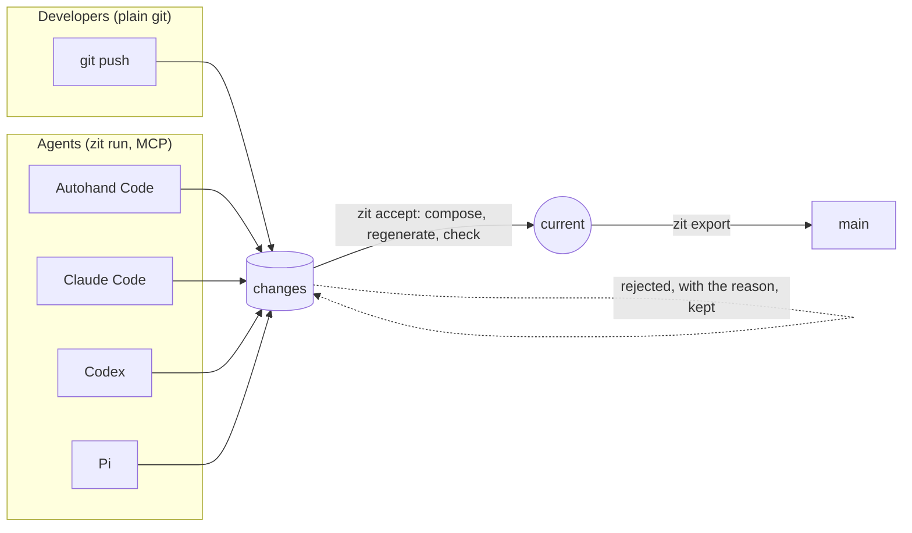

You start an agent on a bug. While it works, you start another on a feature, and a third on the docs. Your teammates do the same, in the same repository. Each agent finishes in minutes, in its own copy of the code, and the changes arrive together.

Most developers are not there yet: most who use agents run one at a time. But the tools now ship this workflow (Claude Code and Cursor both document running several agents in parallel worktrees), and the teams that adopt it hit the same problems:

- **The copies pile up.** Every session gets its own worktree, and every worktree installs its own dependencies: gigabytes, for files that are mostly identical.
- **Collisions show up last.** In a study of 33,596 agent pull requests, four in five were open at the same time as another agent's on the same repository. Among pairs that overlapped, 20% hit a merge conflict when one agent wrote both, and 42% when two different agents did [^research].
- **Git merges what it should not.** One agent changes a function's signature; another, in another file, adds a call to the old one. Git merges both without complaint, and the build breaks afterwards.
- **The reason is lost.** Each agent ends by explaining what it did and why. That explanation disappears with its terminal; the commit says "Update README".

**Zit** is a git extension for teams already running several agents on one repository. It does four things:

1. **Copies without new files.** Each contributor, person or agent, gets a disposable copy of the code, dependencies included, that writes no new files: it shares every file with the other copies until one is edited, so ten agents do not mean ten checkouts and ten `node_modules`. This needs a copy-on-write file system: APFS on macOS; btrfs, XFS or bcachefs on Linux. Elsewhere it is a plain checkout.
2. **Awareness.** Agents on the same machine can see what the others are changing right now and claim work before starting it.
3. **Integration.** Changes land one at a time. Each is compared with what landed since it started, by the functions it changed and the names it uses, and the combined result must pass your checks (current's and the change's own) before it becomes the current state.
4. **Reasons.** Every change keeps its author's own account of what it did and why, as the body of its commit.

## Install and run

Prebuilt binaries for macOS (arm64, x86_64) and Linux (x86_64, arm64) are on the [releases page](https://github.com/autohandai/getzit/releases), each with a SHA-256 checksum. The repository is private for now, so downloading them needs access to it.

```sh
# macOS on Apple silicon; use x86_64-apple-darwin, x86_64-unknown-linux-gnu or aarch64-unknown-linux-gnu elsewhere
gh release download v0.1.0 -R autohandai/getzit -p 'zit-v0.1.0-aarch64-apple-darwin.tar.gz*'
shasum -a 256 -c zit-v0.1.0-aarch64-apple-darwin.tar.gz.sha256
tar xzf zit-v0.1.0-aarch64-apple-darwin.tar.gz && mv zit-v0.1.0-aarch64-apple-darwin/{zit,git-zit} ~/.local/bin/

# Or build it (Rust 1.88+). The setting lets cargo use your git credentials for the private repository:
CARGO_NET_GIT_FETCH_WITH_CLI=true cargo install --git https://github.com/autohandai/getzit --locked
```

Then, in any git repository, give each agent its own workspace and let them run at once:

```sh
git zit init

git zit run --agent autohand --intent "Add a discount function to src/lib.rs" &
git zit run --agent claude   --intent "Add tests for the discount function" &
git zit run --agent codex    --intent "Document discounts in README.md" &
git zit run --agent pi       --intent "Add a --discount flag to the CLI" &
wait

git zit status                 # every change, with what its agent did and why
git zit web                    # watch it in the browser
git zit accept <change>        # land one; a conflict comes back with the reason
git zit export --branch main   # publish to git
```

Each `run` starts the agent's headless mode (`autohand -p`, `claude -p`, `codex exec`, `pi -p`) in a disposable workspace, records whatever it leaves, and keeps its final message as the change's reason. Any other agent works too: `git zit run -- <command>`. [Agents](/agents) has the details, including MCP.

{/* last-build:start */}
### Latest build

| | |
|---|---|
| Commit | [`f9924bf`](https://github.com/autohandai/getzit/commit/f9924bf81ff77339d20d56d5247549bf4769ffc8) Changelog for 0.1.0 |
| macOS (arm64): fmt, clippy, tests, binary | **success** |
| Linux (x86_64): build and tests, plain checkouts (no copy-on-write) | **success
success** |
| Finished | 2026-10-05T07:44:21Z ([run](https://github.com/autohandai/getzit/actions/runs/37278858420)) |

From [autohandai/getzit](https://github.com/autohandai/getzit) CI, written into this page by `scripts/last-build.sh`.
{/* last-build:end */}

## Zit in action

Ten people edit the same `README.md` at the same moment, each in their own workspace. Nine edits land in different sections and compose. Two people wrote the Prices section; the second is refused with the reason, retried on top of the first, resolved, and recorded with why. Then everything is published as one plain git branch, and `zit clean` removes every copy Zit made.


The ten users are scripted (`demo/ten-users.sh`); every line of output is Zit's own. Recorded with [`vhs`](https://github.com/charmbracelet/vhs) from `demo/zit-in-action.tape`.

### The web view

`zit web` shows the same repository live: the accepted line, the changes waiting above it, the people still at work below, and for any of them, what it wrote, why it stands where it does, its author's reason and the next command.


Zit does not review code. It hands the reviewer changes that are already checked, already combined, and explained by their authors; whether a person reads them before they reach `main` is your process (see [Teams and review](/git#teams-and-review)).

Your branches, history and remotes stay plain git. Teammates who never install Zit keep working as before.

| Measured | Result |
|---|---|
| 5 Claude Code agents, the same task, with and without claims (same prompt), 2 rounds each ([Lesson 04](/lessons)) | **10 of 10 landed instead of 4 of 10**; cost per landed change **$1.01 instead of $2.54**; the same judged quality |
| 10 Claude Code agents, one prompt, on a real Rust repository ([Lesson 01](/lessons)) | **5 changes landed instead of 1**, in a sixth of the agent time (one run each) |
| 1,000 scripted changes on a generated Python project ([Benchmarks](/benchmarks)) | **119 of 119** merges that would have broken a check stopped before reaching current; also **21–23%** of good changes refused (the price of being conservative) |
| 5 contributors on a project with 206 MB of npm dependencies ([Benchmarks](/benchmarks)) | **327 MB instead of 1,619 MB**, against `npm ci` per worktree (pnpm not yet measured) |
| 20 scripted git clients and 20 agents on the same 20 Markdown files ([Lesson 03](/lessons)) | **40 of 40 landed** (git's text merge did most of the work); all 20 agents' accounts captured |

Integration is slower than a plain merge loop: 2.2× on cheap checks ([Benchmarks](/benchmarks)). Every number above comes from one machine, a Mac; what is not measured is on [Limits](/limits).

**CPSG**, the Causal Program State Graph, is the design underneath: a program's state is a git tree, a change is a git commit carrying its intent, its author's account and what it read, and the graph of changes lives in `refs/zit/*` beside your branches. [How it works](/science) explains the ideas and where they come from.



New here? [Zit 101](/tutorial) sets it up in ten minutes. [What Zit is, and is not](/why) answers whether you need it.

## What it does

- **Work outlives the agent.** A change is a git object. Kill the agent, delete its directory, move to another machine: the change is still there.
- **Concurrent work is composed by what it read and wrote, not by which lines it touched.** Two agents editing different functions of one file both land. An agent that called a function another agent rewrote is stopped, even though git would merge the two silently.
- **Rejection explains itself and destroys nothing.** A stale change names the symbol and the change that invalidated it, and stays in the graph to be retried.
- **Checks run only where their inputs changed.** Results are stored against the content they depend on.
- **Agents can see each other.** Claims and live write sets let agents sharing a task split it instead of repeating it.
- **You can watch it.** `zit web` draws the graph live in the browser.
- **People keep using git.** A developer's pushed branch is accepted like any agent's change. `git zit …` works wherever `git` does.
- **It is git.** States are trees, changes are commits, the graph is `refs/zit/*`. Any commit can be accepted; current can be exported to any branch.

## Evidence, and where

| Claim | Evidence |
|---|---|
| A change survives its workspace | `a_change_outlives_its_workspace` |
| No worktree or branch is created | `materialise_registers_no_git_worktree_and_no_branch` |
| Different symbols of one file compose | `concurrent_changes_to_different_symbols_of_one_file_compose` |
| A semantic conflict git would merge is caught | `a_change_that_read_what_current_rewrote_is_stale_even_if_git_would_merge_it` |
| Current never moves to a failing state | `the_composed_state_must_pass_its_checks` |
| Racing accepts are safe | `racing_accepts_all_land_exactly_once` |
| Checks are reused when inputs are unchanged | `only_checks_whose_inputs_changed_run_again` |
| Interrupted agents keep their work | `sigint_stops_the_agent_and_records_its_partial_work` |
| The graph moves between machines with git | `the_graph_replicates_with_plain_git` |
| Overlapping claims are refused, exactly one of several racing | `of_racing_claims_exactly_one_wins` |
| Checks stay warm between states | `verification_reuses_one_view_keeping_ignored_build_output_and_nothing_else` |
| Autohand Code, Claude Code and Codex work with it | run for real; see [Agents](/agents) and [Benchmarks](/benchmarks). Pi: preset only, not yet run end to end |
| It holds up with ten agents on a real repository | two one-off runs, not repeated; see [Lessons](/lessons) |
| Generated files are rebuilt, not conflicted | `generated_files_are_regenerated_on_compose_not_conflicted` |
| It works as `git zit` | `zit_is_a_git_extension` |
| 20 scripted git clients and 30 agents on one repository | two one-off runs; see [Lessons](/lessons) |

Test names are in `tests/`; `cargo test` runs them against real git repositories. They show the behaviour exists, on small repositories. The real-agent runs are single runs on one machine: evidence, not statistics.

## Where to go

- [Zit 101](/tutorial) — install it and use it, step by step.
- [What Zit is, and is not](/why) — what it solves, what it does not, and how much disk it saves.
- [Research](/research) — what is measured about coding agents and parallel work, with sources.
- [Quickstart](/quickstart) — three agents, one conflict, resolved.
- [Concepts](/concepts) — the six primitives.
- [How it works](/science) — the ideas behind it and where they come from.
- [Agents](/agents) — Autohand Code, Claude Code, Codex, Pi, and anything else.
- [Benchmarks](/benchmarks) — measured against `git worktree`, including where it is slower.
- [Lessons](/lessons) — what broke with ten real agents, and what changed.
- [Web view](/web) — `zit web`.
- [Limits](/limits) — what it does not do.

Design decisions (the "ADR" references in these pages) are kept with the code, in the repository's `adr/` folder.

[^research]: The figures and their sources are on [Research](/research): Xu et al., arXiv:2607.04697 (2026), on overlapping agent pull requests; Anthropic (2026) on code review as the bottleneck.

