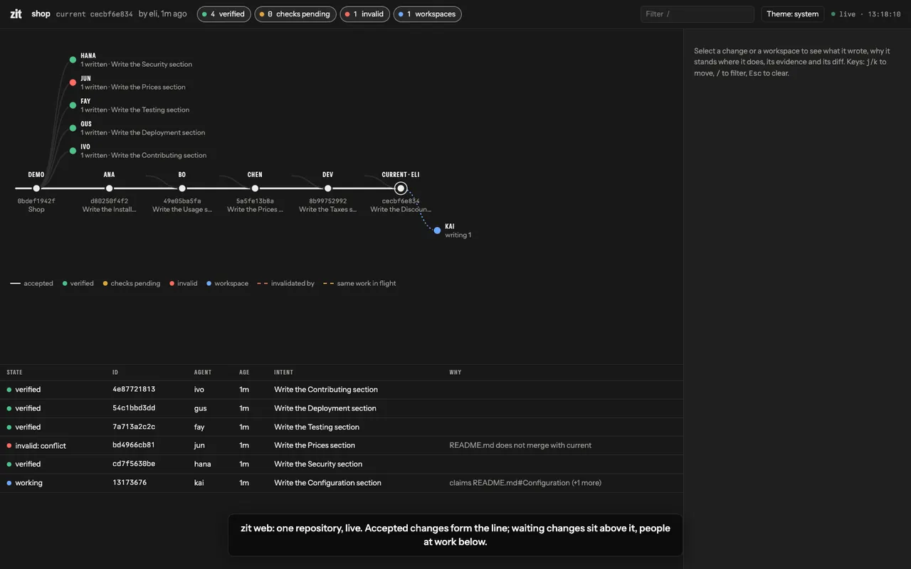

**Zit is a git extension for repositories that several people and coding agents change at the same time.** Each session works in its own copy-on-write copy of the code instead of a git worktree. Sessions on the same machine can see what the others are changing and claim work before starting it. Changes land one at a time, each checked against what landed since it started and against the checks you declare. Your branches, history and remotes stay plain git; teammates who never install Zit are not affected.

## The problem

Claude Code and Cursor document running several agents on one repository in parallel worktrees [^tools]. Most developers who use agents still run one at a time [^research]; teams that run several hit four problems:

- **Copies.** Each worktree is a full checkout, and each one usually installs its own dependencies. On the machine these docs were written on, 57 worktrees took 4.4 GB, 88% of it installed dependencies ([What Zit is, and is not](/why)).
- **Late collisions.** In a study of 33,596 agent pull requests, 79.4% were open at the same time as another agent's pull request on the same repository; overlapping pairs had merge conflicts 19.8% of the time from one agent and 41.7% from different agents (a preprint) [^research]. These surface at merge time, after the work is done.
- **Merges git cannot judge.** One change alters a function's signature; another, in a different file, adds a call that uses the old one. Git merges both; the build breaks afterwards.
- **Lost reasons.** An agent ends a session by saying what it did and why. Unless someone copies that into the commit, it is gone when the session ends.

## How it works

1. **Copy-on-write workspaces.** A workspace is a clone of the cached checkout of its state (APFS on macOS; btrfs or XFS with reflink on Linux, all tested in CI). Files are shared on disk until a session edits one; the workspace itself writes only its git metadata, about 10 MB for a 30,000-file repository against 139 MB for a worktree, measured on APFS. With `[prepare]` in `zit.toml`, installed dependencies are shared the same way. On other file systems a workspace is a plain checkout.
2. **Claims and live write sets.** `zit claim src/lib.rs#price` reserves a file, a symbol or a Markdown section. A claim on something another open workspace holds, or is writing, is refused with who holds it. This works between workspaces on one machine.
3. **Accept.** `zit accept` composes a change onto the current state with `git merge-tree`. It refuses the change if the text does not merge, if it changed the same function, type or section as a change that landed since it started, or if it uses a symbol whose interface (signature, fields, constants) changed in the meantime; then the combined state must pass the checks in current's `zit.toml` and the change's own. Only then does `refs/zit/current` move, by compare-and-swap.
4. **Recorded reasons and cost.** A change is a git commit whose body is its author's account when one is given: `zit run` stores an agent's final message, `zit record --summary` takes one, and a plain commit's body counts. `zit run` also stores the tokens and dollars the agent reports (Claude Code reports both, Codex tokens only).

The design is called CPSG, the Causal Program State Graph: states are git trees, changes are git commits, and the graph is `refs/zit/*` beside your branches. [How it works](/science) has the ideas and their sources; [Limits](/limits) has what Zit does not do.

## Install

Prebuilt binaries for macOS (arm64, x86_64) and Linux (x86_64, arm64) are on the [releases page](https://github.com/autohandai/getzit/releases), each with a SHA-256 checksum. The repository is private for now, so downloading needs access to it. Zit needs git 2.38 or newer.

```sh
# macOS on Apple silicon; for others use x86_64-apple-darwin, x86_64-unknown-linux-gnu or aarch64-unknown-linux-gnu
gh release download v0.1.0 -R autohandai/getzit -p 'zit-v0.1.0-aarch64-apple-darwin.tar.gz*'
shasum -a 256 -c zit-v0.1.0-aarch64-apple-darwin.tar.gz.sha256
tar xzf zit-v0.1.0-aarch64-apple-darwin.tar.gz && mv zit-v0.1.0-aarch64-apple-darwin/{zit,git-zit} ~/.local/bin/

# Or build it (Rust 1.88+); the setting lets cargo use your git credentials for the private repository:
CARGO_NET_GIT_FETCH_WITH_CLI=true cargo install --git https://github.com/autohandai/getzit --locked
```

## Quick start

```sh
cd your-repo
git zit init                                  # refs/zit/current = HEAD; nothing else changes

git zit run --agent claude --intent "Add tests for the discount function" &
git zit run --agent codex  --intent "Document discounts in README.md" &
wait                                          # each agent ran in its own workspace

git zit status                                # the recorded changes and their state
git zit show <change>                         # what it wrote, its author's reason, what it cost
git zit accept <change>                       # land it, or get the reason it cannot land
git zit export --branch main                  # publish current to a branch (or --pr to open a pull request)
```

`zit run` starts the agent in a new workspace, waits for it, and records what it left as a change, however it ends (exit, Ctrl-C, `--timeout`). Your own checkout is not touched. [Zit 101](/tutorial) walks through the same steps with a real repository.

## Agents

| Agent | How | Status |
|---|---|---|
| **Autohand Code** | `autohand --zit "<intent>"` runs a whole session, interactive or `-p`, in a Zit workspace; its file tools claim each file before writing it | Built and run end to end on Autohand Code's `zit-sessions` branch; not in a release yet |
| **Claude Code** | `zit run --agent claude --intent "…"`, or `zit mcp` as an MCP server | Run end to end; reports tokens and cost |
| **Codex** | `zit run --agent codex --intent "…"`, or `zit mcp` | Run end to end; reports tokens |
| **Pi** | the extension in `integrations/pi` (`/zit <intent>`), or `zit run --agent pi` | Commands tested in Pi 0.84.4; no live model turn yet |
| **Any CLI** | `zit run --agent <name> -- <command>` | |

Set-up for each:

```sh
# Autohand Code (from its zit-sessions branch)
autohand --zit "Fix the flaky test" -p "Fix the flaky test in tests/api.rs" --yes

# Claude Code: as a tool server, so the agent can claim and record itself
echo '{ "mcpServers": { "zit": { "command": "zit", "args": ["mcp"] } } }' > zit.mcp.json
claude --mcp-config zit.mcp.json

# Codex: its sandbox must be allowed to write Zit's home, or claims fail
codex exec --sandbox workspace-write --add-dir ~/.zit "…"      # `zit run --agent codex` adds this, for the repository's directory under ~/.zit

# Pi: install the extension once, then /zit <intent> in a session
pi install /path/to/getzit/integrations/pi
```

[Agents](/agents) has every flag, the MCP tools, and how stopping an agent works.

## See it run

Three agents, Autohand Code, Claude Code and Codex, change a copy of a real repository (Autohand's router) at the same time, each in its own Zit workspace, while the fourth pane shows `zit status`. Each was given one documentation task; the prompts are on screen. Autohand Code and Codex both edited `docs/self-hosting.md`.

What happened, in this run:

- Claude Code added a Troubleshooting section to `docs/deployment/container.md`. Recorded with its account and cost: 432,767 tokens in, 4,281 out, $0.46.
- Codex added four FAQs to the end of `docs/self-hosting.md` (260,036 tokens in, 2,435 out).
- Autohand Code's file tools tried to claim all of `docs/self-hosting.md` and were refused, because Codex's unaccepted change had written other sections of it. Autohand claimed its own section instead and made a one-sentence edit there, through the shell, because its file tool still claimed the whole file and was refused again (a fix to claim by section is in progress). It was recorded after 8 minutes 14 seconds.
- `zit accept` then landed all three. The two changes to `docs/self-hosting.md` were composed one onto the other, and the link check passed on each combined state.


The run took 8 minutes 48 seconds; it is shown at 6× speed, otherwise unedited.

### The web view

`zit web` watches a repository live. Here, after ten scripted sessions changed one `README.md`, five changes have landed, four wait their turn, one collided, and three more workspaces are open with unrecorded edits, each holding a claim. For any of them it shows what it wrote, its author's reason, why it stands where it does, and the command to run next. `git worktree list` in that repository shows only the main checkout.



Zit does not review code. It hands the reviewer changes that are already combined, checked and explained; whether a person reads them before they reach `main` is your process ([Teams and review](/git#teams-and-review)).

## Measured

| Measured | Result |
|---|---|
| 5 Claude Code agents, the same task and prompt, with and without claims, 2 rounds each ([Lesson 04](/lessons)) | 10 of 10 changes landed with claims, 4 of 10 without; $1.01 against $2.54 per landed change (Claude Code's own cost figures); a blind model judge scored what landed 3.80 and 3.75 out of 5 |
| 1,000 scripted changes on a generated Python project ([Benchmarks](/benchmarks)) | All 119 merges that would have broken a check were stopped before reaching current; 21–23% of good changes were also refused. Measured before the interface-only staleness rule (ADR 16); not re-measured |
| 5 workspaces of a project with 206 MB of npm dependencies ([Benchmarks](/benchmarks)) | 327 MB with Zit and `[prepare]`, against 1,619 MB for a worktree plus `npm ci` each (pnpm not measured) |
| 10 workspaces of a 30,000-file repository ([Benchmarks](/benchmarks)) | APFS: 98 MB against 1,390 MB for worktrees. btrfs: under 0.1 MB against 24 MB. ext4 (no copy-on-write): the same as worktrees |
| Integration time against a plain merge loop, cheap checks ([Benchmarks](/benchmarks)) | 2.2× slower |

All real-agent runs are single runs on one Mac; the Linux numbers come from a 2-core CI runner. What is not measured is listed on [Limits](/limits).

## Evidence, and where

| Claim | Evidence |
|---|---|
| A change survives its workspace | `a_change_outlives_its_workspace` |
| No worktree or branch is created | `materialise_registers_no_git_worktree_and_no_branch` |
| Different symbols of one file compose | `concurrent_changes_to_different_symbols_of_one_file_compose` |
| A change that uses an interface that changed is refused, even if git would merge it | `a_change_that_read_what_current_rewrote_is_stale_even_if_git_would_merge_it` |
| A body-only change does not stale its callers | `a_callee_body_change_does_not_make_its_callers_stale` |
| Current never moves to a failing state | `the_composed_state_must_pass_its_checks` |
| Racing accepts are safe | `racing_accepts_all_land_exactly_once` |
| Checks are reused when inputs are unchanged | `only_checks_whose_inputs_changed_run_again` |
| Interrupted agents keep their work | `sigint_stops_the_agent_and_records_its_partial_work` |
| The graph moves between machines with git | `the_graph_replicates_with_plain_git` |
| Overlapping claims are refused, exactly one of several racing | `of_racing_claims_exactly_one_wins` |
| Checks stay warm between states | `verification_reuses_one_view_keeping_ignored_build_output_and_nothing_else` |
| A change cannot weaken current's checks | `a_change_cannot_weaken_the_checks_it_is_judged_by` |
| Evidence fetched from a remote is not trusted | `a_planted_passing_result_does_not_get_a_failing_change_accepted` |
| Generated files are rebuilt, not conflicted | `generated_files_are_regenerated_on_compose_not_conflicted` |
| It works as `git zit` | `zit_is_a_git_extension` |

Test names are in `tests/`; `cargo test` runs them against real git repositories. They show the behaviour exists, on small repositories. The real-agent runs are single runs on one machine: evidence, not statistics.

{/* last-build:start */}
### Latest build

| | |
|---|---|
| Commit | [`d51a944`](https://github.com/autohandai/getzit/commit/d51a944d1e4aa391b84fa1466d8088c56bddcfed) Say only what is measured or tested: workspace metadata, file systems… |
| macOS (arm64) | **success** |
| Linux (btrfs, copy-on-write) | **success** |
| Linux (x86_64, plain checkouts) | **success** |
| Linux (xfs, copy-on-write) | **failure** |
| Finished | 2026-10-06T10:19:24Z ([run](https://github.com/autohandai/getzit/actions/runs/37448415693)) |

From [autohandai/getzit](https://github.com/autohandai/getzit) CI, written into this page by `scripts/last-build.sh`.
{/* last-build:end */}

## Where to go

- [Zit 101](/tutorial) — install it and use it, step by step.
- [What Zit is, and is not](/why) — what it solves, what it does not, and how much disk it saves.
- [Research](/research) — what is measured about coding agents and parallel work, with sources.
- [Prior art and objections](/prior-art) — who else has tried this, the case against Zit, and where it is weak.
- [Quickstart](/quickstart) — three agents, one conflict, resolved.
- [Concepts](/concepts) — the six primitives.
- [How it works](/science) — the ideas behind it and where they come from.
- [Agents](/agents) — Autohand Code, Claude Code, Codex, Pi, and anything else.
- [Benchmarks](/benchmarks) — measured against `git worktree`, including where it is slower.
- [Lessons](/lessons) — what broke with ten real agents, and what changed.
- [Web view](/web) — `zit web`.
- [Limits](/limits) — what it does not do.
- [Roadmap](/roadmap) — what is planned, and why.

Design decisions (the "ADR" references in these pages) are kept with the code, in the repository's `adr/` folder.

[^research]: Sources on [Research](/research): Stack Overflow (April 2026) for single-agent use; Xu, Subramanian and Karthik, arXiv:2607.04697 (July 2026), for overlapping agent pull requests.
[^tools]: Claude Code documentation, "Run parallel sessions with worktrees"; Cursor documentation, "Worktrees". Links on [Research](/research).

