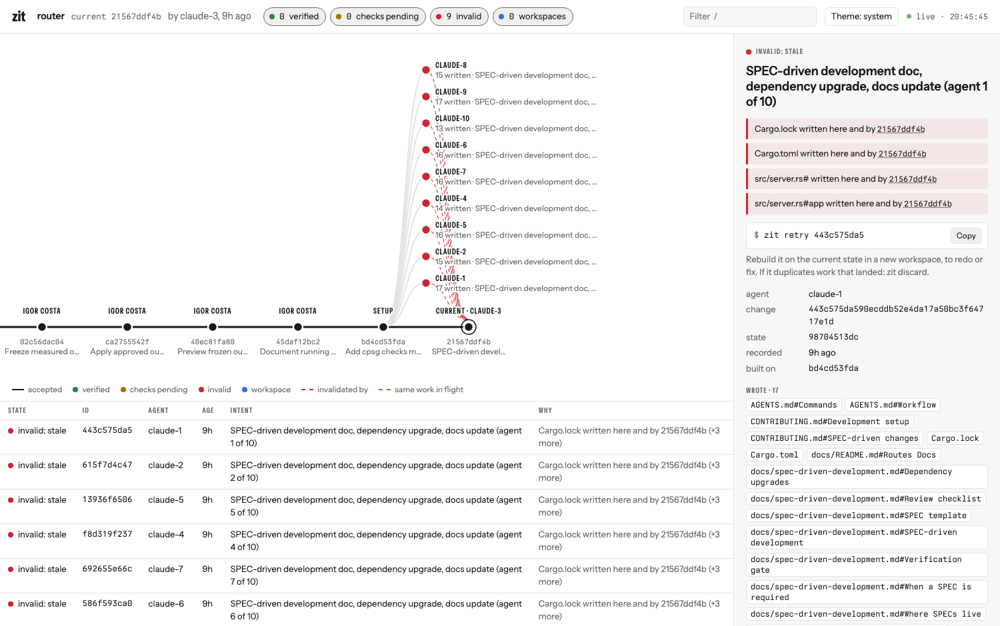
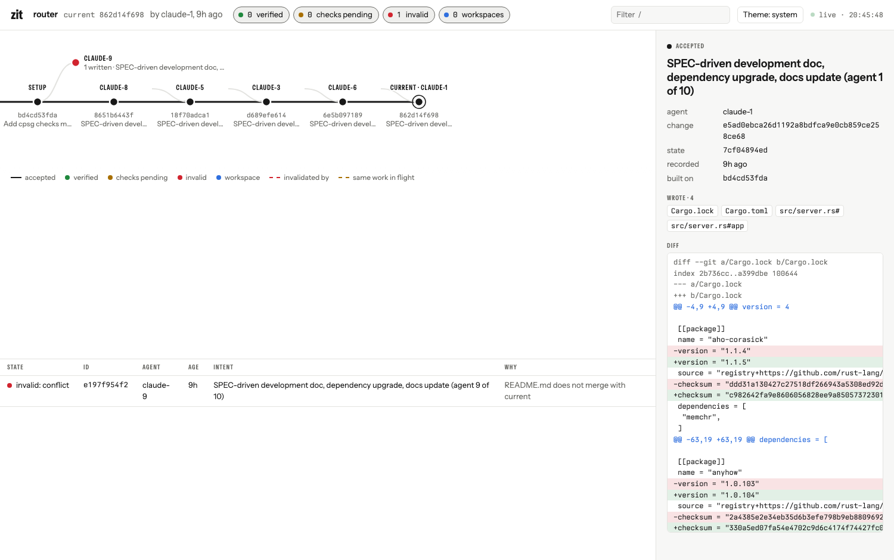

The best test of Zit is agents doing real work. Three experiments so far. The full records, with every number and the test that now covers each fix, are in `lessons_learnt/` in the repository.

## Lesson 03: 20 developers and 20 agents on the same 20 files

Twenty developers using plain git and twenty agents (10 Claude Code, 10 Codex) changed the same 20 Markdown files of the router at the same time: one developer and one agent per file, both editing the opening or both appending at the end.

| | |
|---|---:|
| Landed | **40 / 40** (36 first time; 4 text conflicts, all redone and landed) |
| Accepted changes that carry their author's account of what and why | **40 / 40** |
| Peak disk for Zit's workspaces and caches | 62 MB (the developers' 20 plain clones: 80 MB) |
| Left on disk after `zit clean` | nothing; graph and accounts intact |

What changed: a change now stores what its author reported doing and why (an agent's final message, a commit's body), and `zit clean` deletes every local copy Zit made. The router itself has one broken link, found by the check: `examples/README.md` points to `router.local.yaml`, which does not exist. Full record: `lessons_learnt/lesson_03.md`.

## Lesson 02: 20 developers and 30 agents, one repository

Twenty developers using plain git and thirty agents (15 Claude Code, 15 Codex) were given 50 tasks on a copy of `awesome-sub-agents`, a catalogue whose README and generated `registry.json` every new entry touches. Some tasks overlapped on purpose.

| | Developers only, Zit before | Developers only, plain git | Developers only, Zit after | Everyone, round 1 | Everyone, round 2 |
|---|---:|---:|---:|---:|---:|
| Landed | 12 / 20 | 20 / 20 | 20 / 20 | 42 / 50 | 46 / 50 |
| Correctly did nothing (task already done) | – | – | – | 3 | 3 |
| Final state passes validation | yes | yes | yes | yes | yes |

What broke, and what changed:

| Problem | Change |
|---|---|
| A generated file (`registry.json`) made every pair of changes conflict. Zit did worse than plain git. | Declared generated files are rebuilt on the combined state (ADR 12) |
| Two people adding bullets to one README section was a conflict | Markdown is merged as text; code stays strict (ADR 12) |
| Agents' Python bytecode became part of their changes; one landed in `main` | Built-in ignores for tool by-products, plus `ignore` in `zit.toml` (ADR 13) |
| `zit status` and `zit claim` cost O(N²) git processes; load average 407, agents waited minutes | Live write sets reused for 2 s; claim scan outside the lock: 10 simultaneous claims 3.0 s → 0.3 s (ADR 13) |
| Inside Codex's sandbox, Zit could not claim or see edits | The `codex` preset grants Zit's directories; snapshots avoid git metadata (ADR 13) |
| Installed dependencies are 88% of what worktrees cost on disk; Zit shared none of it | `[prepare]` installs once and clones the install: 5 contributors 1,619 MB → 327 MB (ADR 14) |

What held: every final state was valid. No duplicate entries landed, although four tasks were duplicates. A validator made stricter mid-run by one agent correctly stopped nine other agents' changes until they were redone against it. A full disk did not damage any accepted state.

## Lesson 01: ten agents, one prompt

Ten Claude Code agents were given one prompt — document a SPEC-driven workflow, upgrade the dependencies, update the docs — on a 150-file Rust project, twice. The full record, with every number and every test that now covers each fix, is `lessons_learnt/lesson_01.md` in the repository.

### Round 1: the prompt alone

All ten agents wrote the same seven resources. One change was accepted; eight were stale; one did not compile, although its agent reported that every check passed. 69 agent-minutes, about 63 of them discarded.

Zit was correct and wasteful. Optimistic concurrency assumes conflicts are rare and finds them at the end. Ten copies of one task make them certain.

### Round 2: the same prompt, with claims

Four agents split the task within about a minute. Four others saw nothing unclaimed worth doing and stopped after about 20 seconds. Five changes landed. The final state passed every check when re-run from scratch.

| | Round 1 | Round 2 |
|---|---:|---:|
| Wall time | 992 s | 189 s |
| Sum of agent run times | 4,128 s | 697 s |
| Changes accepted | 1 | 5 |
| Changes rejected | 9 | 1 |

Tokens and cost were not captured, and the two results were not compared for quality.

### What changed in Zit

| Problem observed | Change | Decision |
|---|---|---|
| Duplicate work is only discovered at accept | Claims, and live write sets of open workspaces | ADR 11 |
| Every verification rebuilt the project at a new path: 90 s and 600 MB each | Verification views at stable paths, updated in place | ADR 10 |
| Concurrent agents collided on fixed temp-file names | A private `TMPDIR` per workspace and per check | ADR 10 |
| No shared place for build caches | `$ZIT_CACHE_DIR` | ADR 10 |
| Any two documentation edits to one file conflicted | Markdown sections are resources | ADR 3 |
| A runaway agent had no deadline | `zit run --timeout` | ADR 8 |
| A flaky failure is cached forever | `accept --rerun` | ADR 4 |

### What it confirmed

- **Evidence beats reports.** The one change that did not compile came with a report saying it did. The checks on the recorded state caught it.
- **Content-addressed evidence works on real work.** Six of ten round 1 changes had identical code; the checks ran four times, not ten. Documentation-only changes needed no check runs.
- **Nothing is left behind.** Twenty agent runs, no branches, no worktrees, no workspaces remaining.

### What is still open

- Each agent on a compiled project rebuilds the project at its own path. A pool of agent workspaces at stable paths is designed but not built.
- One duplicate still got through in round 2. The fix (what a workspace is writing counts as held, claimed or not) has tests but has not been re-run with agents.
- Ports and global caches are still shared between agents on one machine.
- Zit has nowhere to put a question every agent on a task should see answered once. All ten agents separately reported that "our SDK" does not exist in the repository.
