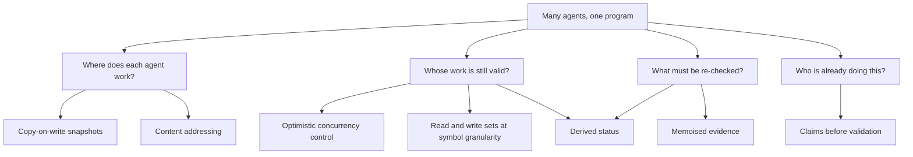
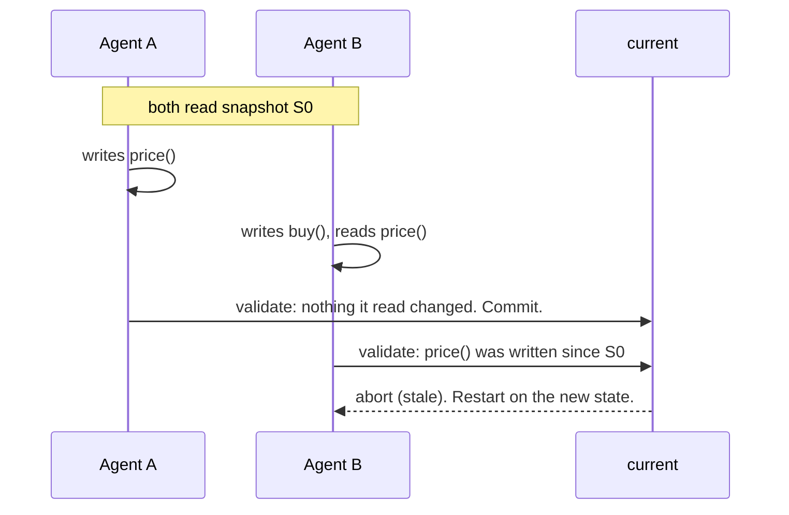

Zit invents very little. It combines seven known ideas, each with decades of work behind it, and applies them to one problem: many agents changing one program at the same time.

## 1. Content addressing: a state is its hash

**The idea.** Name a thing by the hash of its content. A directory's name is the hash of its entries' names, so the root hash names the whole tree (a Merkle tree, 1979). Equal content has equal names; any change changes the name of everything above it and nothing else.

**In zit.** A state is a git tree; its id is the root hash. This gives three properties for free:

- Two agents that produce the same program produce the same state. There is nothing to reconcile.
- "Did anything under `ui/` change?" is one comparison of two ids.
- States, changes and evidence are immutable, so they can be copied between machines without coordination.

## 2. Optimistic concurrency control: work first, validate at the end

**The idea.** Kung and Robinson (1981) observed that locking is wasteful when conflicts are rare. Let every transaction run against a private snapshot with no locks. At commit time, **validate**: if anything the transaction *read* was *written* by a transaction that committed in the meantime, it saw a world that no longer exists, so restart it. Otherwise its effects are the same as if it had run alone, after the others.

**In zit.** An agent's turn is a transaction.

| Database term | Zit |
|---|---|
| snapshot | the state a workspace was materialised from |
| private workspace | the workspace |
| write set | symbols whose content differs between base and result |
| read set | symbols the change mentions, plus those the agent declared |
| validation | `accept` compares the change's sets with what current wrote since their common ancestor |
| abort and restart | rejected as stale; `retry` on the new current |
| commit | `refs/zit/current` moves by compare-and-swap |

**Why git alone is not enough.** A text merge detects one kind of conflict: both sides wrote the same lines (write-write). It cannot see that one side *read* what the other wrote. Databases call the resulting anomaly **write skew** (Berenson et al., 1995): each transaction is consistent alone, they touch different rows, and together they break an invariant. A "semantic merge conflict" — one agent changes a function's signature while another adds a call to it in a different file — is write skew. Detecting it requires read sets. That is the reason Zit tracks them.

**What is guaranteed.** If declared read sets were complete, the accepted history would be equivalent to running the changes one at a time in acceptance order. Inferred reads deliberately ignore body-only changes (ADR 16), which is why the checks run on the composed state before current moves. They are not complete (next section), so Zit runs the checks on the composed state before current moves. Validation catches what it can name; checks catch the rest.

## 3. Granularity: symbols, found by parsing

**The idea.** The unit of conflict decides how much concurrency survives. Files are too coarse: two agents editing different functions of one file would always conflict. Lines are too fine and carry no meaning.

**In zit.** Each changed file is parsed (tree-sitter) into top-level symbols: eight languages (Rust, Python, JavaScript, TypeScript, Go, Java, Ruby, C#), Markdown by heading, and TOML and JSON manifests by top-level key. A symbol is written if the hash of its text changed. A symbol is read if a written symbol mentions its name. A renamed file is compared unit by unit across the rename, so a move writes nothing. This is a deliberate over-approximation:

- It needs no type checker or build, so it works on code that does not compile yet.
- It matches by name, so it sometimes refuses changes that were fine. Measured: 21–23% of changes in the scripted benchmark (before the interface-only rule of ADR 16; not re-measured); see [Benchmarks](/benchmarks).
- It cannot see dynamic dispatch or names built at runtime. The checks are the backstop.

## 4. Memoised evidence: never compute the same answer twice

**The idea.** A build system is a memoised function from inputs to outputs. Mokhov, Mitchell and Peyton Jones ("Build Systems à la Carte", 2018) show that the essential trick is recording, for each result, the hashes of the inputs it depended on; if those hashes are unchanged, the result is still valid and work stops early. Adapton (Hammer et al., 2014) does the same on demand: nothing is recomputed until someone asks.

**In zit.** A check result is stored under `hash(check, hashes of its input paths)`. Because a path's hash is a Merkle hash (idea 1), "are the inputs unchanged?" is exact and costs one lookup. A change that touches only `docs/` reuses every result whose inputs do not include `docs/`.

**Generated files are outputs, not inputs.** A build system never asks two developers to reconcile a compiled binary; it rebuilds it. A file a script derives from other files is the same. Zit regenerates declared generated files on the composed state instead of treating concurrent writes to them as conflicts (ADR 12). On a catalogue repository, this, together with merging Markdown sections as text, took 20 concurrent developers from 12 landed to 20.

## 5. Copy-on-write snapshots: isolation without copying

**The idea.** Give each writer what looks like a private copy, but share the underlying blocks until someone writes. Filesystems expose this as clones (APFS) or reflinks (btrfs, XFS).

**In Zit.** A workspace is a clone of a cached checkout of its state: APFS clones on macOS, `FICLONE` reflinks on btrfs and XFS on Linux. Creating one writes metadata only, no file contents and no second install of dependencies. Measured on APFS: about 14x less disk for ten workspaces of a 30,000-file tree.

## 6. Derived status: no invalidation protocol

**The idea.** State that can be computed should not be stored. Stored state needs a protocol to keep it true; computed state is true by construction.

**In zit.** A change's status (verified, stale, …) is a function of the graph and the evidence, computed when asked. When current moves, every speculative change's status changes with it, and nothing had to be notified.

Because it is a pure function of (change, current, evidence), its result can be cached under exactly those inputs. `zit status` writes each answer to `cache/status/<id>` with the current id and a fingerprint of the evidence refs, and reuses it while both match; a different key is simply not an answer. Nothing is invalidated, because nothing stored claims to be true on its own. Measured on 100 changes over a 200-file project: a repeated `status` went from 462 ms to 52 ms and from 304 git calls to 5 (`bench/status.sh`, [Benchmarks](/benchmarks#7-status-and-git-processes)). The first `status` after current moves still evaluates every change.

## 7. Contention management: ask before, validate after

**The idea.** Optimistic schemes are efficient when conflicts are rare and wasteful when they are common, because every loser has already done its work. Databases and transactional memory handle this by putting a cheap, early signal in front of validation: declare intent, and back off if someone else has it. Collaboration research found the same for people: Crystal (Brun et al., 2011) showed that telling developers about conflicts with unmerged work early makes them cheap to avoid.

**In zit.** Two things sit in front of `accept`:

- **Claims.** A workspace announces the resources it intends to write. An overlapping claim is refused, atomically, naming the holder.
- **In-flight write sets.** `status` and the [web view](/web) show what every open workspace is writing now and where unaccepted work overlaps.

They are advisory. An agent that ignores them is still caught by validation. Their purpose is to stop the work before it is done.

**Measured.** Ten agents with one prompt: 1 change accepted and 9 rejected without claims; 5 accepted and 1 rejected with them, in a sixth of the agent time ([Lessons](/lessons)). This idea was not in the first design. It was added because the experiment showed the first six were correct and wasteful.

## What Zit stores, and what it does not

The graph lives in the repository's git object store. Workspaces and caches live under `$ZIT_HOME` (default `~/.zit`), in a directory named from the repository and a hash of its git-directory path. Each clone has its own local state.

| Where | What | Pushed? | Deleted by |
|---|---|---|---|
| Git objects and `refs/zit/*` | Accepted history, recorded changes, evidence | With push/fetch of these refs | Ref deletion, then `git gc` for unreachable objects |
| Git directory: `zit/evidence-produced/` (usually `.git/zit/evidence-produced/`) | Local evidence ledger: one file per check key, containing the state id | No | Manual removal; `zit clean` keeps it |
| Zit home: `ws/<id>/` | Working tree, git index, `meta.json`, `claims`, `reads`, `summary.txt`, `tmp/`, `inflight.json` | No | `zit dispose <id>` or `zit clean` |
| Zit home: `trees/` | Cached checkouts, including installed dependencies | No | Cache eviction or `zit clean` |
| Zit home: `verify/` | Reused verification views and their build files | No | Replacement of a view or `zit clean` |
| Zit home: `cache/footprint-v3/` | Computed writes, inferred reads, declared reads, renames and interface changes, one file per `base-tip` span plus `reads.json` | No | `zit clean` |
| Zit home: `cache/status/` | Each change's last status with the current and evidence it was derived from | No | `zit clean` |
| Zit home: `shared/` | Shared build and package caches, exposed to agents and checks as `$ZIT_CACHE_DIR` | No | `zit clean` |
| `$ZIT_HOME/git-ok/` | One marker per git binary found new enough (keyed by path, size, modification time) | No | Manual removal; `zit clean` keeps it |

**The git record.** `refs/zit/current` points to the accepted current commit. `refs/zit/changes/<id>` keeps a recorded speculative change. `refs/zit/evidence/<key>` points to a JSON blob containing a check result. `refs/zit/logs/<id>` points to a blob with the last 64 KB of an agent's output when `zit run --log` kept it.

A change commit contains its resulting tree, parents, author and committer identities and dates. Its message contains the intent and the author's account of what was done and why. Trailers carry `Zit-Agent`, optional `Zit-Session`, declared `Zit-Read` resources, and reported `Zit-Tokens` and `Zit-Cost-USD` when available. Linear acceptance of a composed change adds `Zit-Change`, naming the original change.

An evidence blob contains the check name, cache key, state id, pass/fail result, exit code, duration in milliseconds, timestamp and up to 4,000 bytes from the end of combined stdout and stderr. Results with exit code `-1` (including timeouts) are not persisted. The local ledger marks which check keys this clone has run; fetched evidence is otherwise untrusted unless `zit.trustFetchedEvidence` is enabled.

**Local state and lifetime.** Workspace metadata records its id, base commit and tree, optional merge parent, intent, agent, session, creation time, owner pid and its start time, the port chosen for it, and path. `summary.txt` is the agent's summary file (`$ZIT_SUMMARY_FILE`). Each workspace has a separate `tmp/`, passed as `$TMPDIR`.

Claims last until disposal. Declared reads are copied into a change and their local file is removed after recording it. `zit run` normally records the work and disposes the workspace; `--keep` leaves it in place. Other workspaces stay until disposed or cleaned.

Cache eviction tries to keep the two newest cached checkouts, skipping eviction while they are in use. Up to eight verification views are reused; reuse removes untracked files and edits but keeps ignored build files. Their temporary files are cleared before the next verification. In-flight write sets are reused for up to two seconds, then recomputed on demand; the cache file stays until replaced or the workspace is deleted. Footprint and shared caches stay until cleaned. Graph refs and the evidence ledger have no timed expiry; acceptance retires a speculative ref, and a new verdict can replace an evidence ref.

**What is not kept.** Zit has no separate agent transcript or prompt archive. `zit run` records the intent and a summary taken from the summary file, the agent's final message, or, as a fallback, the tail of stdout. The captured summary is limited to the last 8,000 bytes (at most 8,000 characters). This limit does not apply to a summary supplied directly to `zit record` or MCP. With a preset agent, the stored intent is also the prompt passed to that agent.

Zit has no model credential store, hosted service or telemetry. Its web view listens only on localhost; MCP uses stdin and stdout. Agents and check commands can still send or save data themselves, and `zit export --pr` explicitly pushes a branch and opens a pull request. There is no second history database outside git: the local directories hold working files and caches.

**Who can read it.** Local files are subject to filesystem permissions. If you push `refs/zit/*`, anyone who can fetch those refs can read their commits and evidence. Exported commits also travel with the branch you publish. Summaries and check output can contain whatever the agent or check printed. Treat them like commit messages and CI logs.

**Removal.** `zit dispose <id>` deletes one workspace. Edits not recorded or otherwise saved are lost; in-flight inspection uses temporary git objects and removes them afterwards. `zit clean` deletes this repository's directory under Zit's home, including every cache listed above. It refuses live runs, unrecorded edits and busy clone or verification locks unless forced. The graph and evidence ledger survive.

To remove the graph refs, delete them all at once: `git for-each-ref refs/zit --format='delete %(refname)' | git update-ref --stdin`. `zit discard <change>` removes just that speculative change's ref. Objects remain while another ref or history still reaches them; `git gc` eventually drops unreachable objects under git's retention rules. Local deletion does not remove refs or objects already pushed to another repository.

## What Zit is not

| Approach | What it guarantees | Why Zit is not that |
|---|---|---|
| **CRDTs** (Shapiro et al., 2011) | Replicas that apply the same edits converge to the same text, with no coordination | Convergence is about the text. It says nothing about whether the converged program is correct. Zit wants a *validated* state, and accepts coordination at one point (acceptance) to get it. |
| **Patch theories** (Darcs, Pijul; Mimram and Di Giusto, 2013) | Independent patches commute, so order does not matter | Independence is defined on text. Zit defines it on what was read and written. The idea that a change records its dependencies comes from here. |
| **Merge queues** (for example Uber's SubmitQueue, 2019) | The main branch stays green by testing each candidate before it lands | Zit's `accept` is a merge queue. What it adds is validation before testing, and evidence reuse. |
| **Locking** (file locks, exclusive checkouts) | Nobody else can touch what you hold | Zit's claims are advisory and lapse when their workspace is disposed. Nothing is ever blocked from being recorded; a claim only tells the next agent to choose other work. |

## The cost model

For *n* speculative changes against one current:

| Step | Work | Grows with |
|---|---|---|
| Materialise | a copy-on-write clone: metadata only | number of files in the repository |
| Record | a few git calls, plus parsing the files the change touched | size of the change |
| Claim | a scan of the open workspaces | how many agents are working right now |
| Validation | one diff of current against the merge base, cached and shared by every change with that base | what current changed |
| Verification | only checks whose inputs changed | the checks' own cost |
| Acceptance | one ref compare-and-swap | nothing |

Acceptance is a single line: each accept verifies the state it will actually produce. A batch (`zit accept A B C`, `zit accept --batch`) composes several changes in order and verifies the combined state once, so the checks are paid once for the batch instead of once per change; a failing check rejects the whole batch, since one verification cannot say which member broke it. The throughput limit is still how long the checks take, not zit.

**What limits a thousand agents.** From the measurements so far, in order:

1. **Wasted work**, when agents share a task. Addressed by claims (idea 7).
2. **Build state per agent.** On a compiled project each agent rebuilds the project at its own path. Verification no longer does (ADR 10); agent workspaces still do. Not solved.
3. **Check time on the accepted line.** Evidence reuse removes checks whose inputs did not change (idea 4). Batches verify several changes with one run of the checks; what a batch cannot do is say which member broke a failing check, and a conflict graph that picks the members automatically is not built.
4. **Zit's own overhead**: 7 git processes for a record, 9 for a fast-forward accept, 16 for a composing accept (counted with `bench/calls.sh`, including `cat-file --batch` sessions; 10, 14 and 29 before this pass), a few milliseconds each. Last, not first.

The largest runs so far are 1,000 scripted changes from 100 scripted agents ([Benchmarks](/benchmarks)) and 20 git developers with 30 real agents on one repository ([Lessons](/lessons)). Nothing larger is claimed.

## References

- R. Merkle, *A Certified Digital Signature*, 1979.
- H. T. Kung and J. T. Robinson, *On Optimistic Methods for Concurrency Control*, ACM TODS, 1981.
- H. Berenson et al., *A Critique of ANSI SQL Isolation Levels*, SIGMOD, 1995.
- M. Shapiro et al., *Conflict-free Replicated Data Types*, SSS, 2011.
- Y. Brun et al., *Proactive Detection of Collaboration Conflicts*, ESEC/FSE, 2011.
- S. Mimram and C. Di Giusto, *A Categorical Theory of Patches*, 2013.
- M. Hammer et al., *Adapton: Composable, Demand-Driven Incremental Computation*, PLDI, 2014.
- A. Mokhov, N. Mitchell and S. Peyton Jones, *Build Systems à la Carte*, ICFP, 2018.
- S. Ananthanarayanan et al., *Keeping Master Green at Scale*, EuroSys, 2019.
