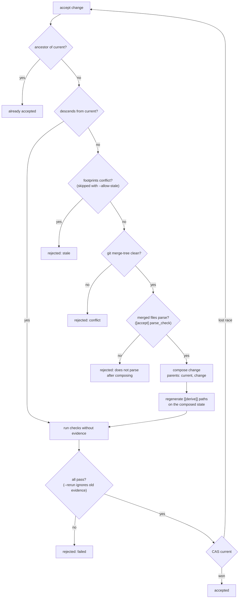

Normative for version 0.1. The reasons behind each part are recorded as architecture decision records (ADR 1 to ADR 17) in the `adr/` folder of the repository. Each rule names the test that enforces it where one exists.

## 1. Objects

### 1.1 State

A git tree object. `state id = tree id`.

### 1.2 Change

A git commit object.

| Commit field | Meaning |
|---|---|
| tree | resulting state |
| parents | changes built on. First parent: the base. Second parent, if any: a change composed in |
| author name | agent |
| message | intent, then the author's account, then trailers |

Trailers, one per line, after the intent:

```text
Zit-Agent: <name>
Zit-Session: <id>                  (optional)
Zit-Read: <resource>               (zero or more)
Zit-Tokens: <in> in, <out> out     (optional: what the agent reported)
Zit-Cost-USD: <dollars>            (optional)
Zit-Change: <commit id>            (on a linear compose: the change it lands)
```

Every trailer value is one line: control characters are dropped, newline and tab become a space, so an agent name, session id or declared read cannot end the trailer and start another. In the intent and account, a line starting with `Zit-` is indented by one space so it is not read back as a trailer. (`a_declared_read_cannot_forge_a_trailer`, `a_session_id_cannot_forge_a_trailer`)

A linear compose carries the `Zit-Read` trailers of every change it lands, and one `Zit-Change` per change; the trailers on `base..current` are how Zit tells that a change, or an ancestor of it, landed linearly. (`a_linear_compose_keeps_the_declared_reads_of_the_change`, `a_linear_accept_of_a_chain_tip_accepts_the_chain`)

The committer is the person running Zit (`user.name`, `user.email`), and the commit is signed when `commit.gpgsign` is set. (`tests/teams.rs`, `tests/usage.rs`)

The first paragraph of the message is the intent; any further paragraphs before the trailers are the **account**: what the author reported doing and why (`summary`). A commit with no trailers is a valid change: agent = author name, intent = subject, account = body, no declared reads. (`a_plain_git_commit_is_a_change`)

### 1.3 Resource

```text
resource = path                 ; whole file
         | path "#" name        ; top-level symbol
         | path "#" type "::" m ; a method of a type
         | path "#(imports)"    ; the file's imports
         | path "#"             ; module-level code outside symbols
```

The path is everything before the first `#`; in it, a literal `#` is written `%23` and `%` is written `%25`. (`hashes_in_paths_and_names_round_trip`)

Two resources overlap iff they are equal, or one is a whole file and both have the same path. For claims only, a type also holds its methods (`T` and `T::m`).

### 1.4 Evidence

A JSON blob:

```json
{ "check": "ui", "key": "9f2c…", "state": "<tree id>", "passed": true,
  "exit_code": 0, "duration_ms": 412, "output": "<last 4000 bytes>", "at": 1791025806 }
```

`key = sha256(name NUL run NUL inputs)[..16 hex]`, where `inputs` is, for each declared input path in sorted order, `path NUL "<mode> <type> <object id>" NUL` as printed by `git ls-tree`, or `path NUL "-" NUL` if absent. Input paths are normalised first (`./ui/` is `ui`); a path containing `..` is an error. With no declared inputs, `inputs` is the state id. (`input_paths_are_normalised_before_they_are_looked_up`)

## 2. Refs

| Ref | Value | Written by |
|---|---|---|
| `refs/zit/current` | commit | `init`, `accept` |
| `refs/zit/changes/<commit id>` | commit | `record`; deleted by `accept`, `discard` |
| `refs/zit/evidence/<key>` | blob | `check`, `accept` |
| `refs/zit/logs/<commit id>` | blob: the last 64 KB of the agent's stdout and stderr | `run --log`; not deleted by `discard` |

Fresh evidence from an accept is published in the same `update-ref` transaction that moves current; if the move loses the race, the evidence is written alone and the accept retried.

A clone trusts only the evidence it produced, listed in `<git dir>/zit/evidence-produced/<key>`, unless `git config zit.trustFetchedEvidence true`. A fresh result with the same verdict as an existing ref keeps the existing object. (`tests/replicate.rs`)

**Invariant.** `refs/zit/current` only moves by compare-and-swap from the value the accepting process observed. (`racing_accepts_all_land_exactly_once`)

## 3. Footprint

`footprint(base, tip)`:

1. `git diff-tree -r -z -M base tip` (renames at git's default 50% similarity; copies are not detected). `renames` = the `old → new` pairs.
2. For each changed path, index the old and new blob into units: top-level symbols and methods (`Type::method`), the imports (`(imports)`), and everything else (`path#`). Each unit has a hash of its text, a hash of its **interface** (its text without function bodies and comments, including comments inside a type that has methods), and the identifiers it mentions. Attributes and comments directly above an item belong to it. For a renamed path the old blob is indexed under the old path and the new under the new; the units are compared across the pair.
3. `writes` = units whose hash differs, added or removed; `path` if either side has no grammar, is not UTF-8, is not a regular file, or exceeds 1 MiB. Across a rename, a changed or added unit is written at the new path, a dropped unit at the old path, an unchanged unit at neither. `signatures` = the written units whose interface hash differs.
4. `refs` = identifiers mentioned by the new version of each written unit, excluding the identifier that declares it, and excluding members of values (`x.get`); members of imported modules (`lib.price`) count.
5. `reads` = every `Zit-Read` of the commits in `base..tip`; for a single-parent span, the change's own.

`conflicts(mine, theirs)`: for each resource `w` in `theirs.writes`: *write-write* if it overlaps one of `mine.writes`; else *read-write* if it overlaps one of `mine.reads`, or if `w` is in `theirs.signatures` and `mine.refs` names it (its name, or for `T::m`, its type `T`). Symmetrically, *write-read*. Writes at a renamed path are mapped to the base path before comparison, so `old#sym` and `new#sym` are the same resource to the other side. At accept, write-write on prose (Markdown) and on `(imports)` is left to the text merge; on generated paths it is ignored. (`tests/renames.rs`)

Footprints are cached under `cache/footprint-v3/<base>-<tip>.json`, declared reads under `reads.json`. (The directory name changes with the symbol rules.)

Symbol naming:

| Language | Symbols | Methods, as `Type::method` |
|---|---|---|
| Rust | every top-level `*_item`, `macro_rules!`; an `impl` block's header joins its type, named from the parse tree (`impl Tr for &'a Foo` is `Foo`) | functions in `impl` blocks |
| Python | `def`, `class`, decorated definitions, `NAME = …` | functions in a class body |
| JavaScript, TypeScript, TSX | function, class, interface, type, enum, `const`/`let`/`var` declarators, `declare …`, `namespace N {}`, overload signatures, and their `export`ed forms | `method_definition`s, abstract method signatures and overload signatures in a class body |
| Go | `func`, `type`, `const`, `var` | methods, by receiver type (`*Stack[T, U]` is `Stack`) |
| Java | class, interface, enum, record, `@interface`; the `package` line is `path#` | methods and constructors |
| Ruby | class, module, top-level `def` and `def self.x`, top-level `CONST`; `require`, `require_relative`, `load` are `(imports)` | `def` inside a class or module |
| C# | class, interface, struct, record, enum, delegate; `using` is `(imports)`; a block `namespace` is not a unit (its declarations are top level, its name `path#`); a file-scoped namespace is `path#` | methods and constructors, including expression-bodied |
| Markdown | each heading's section, named by the heading text | — |
| TOML | each top-level table or key (`Cargo.toml#package`, `#dependencies`; `[profile.release]` is under `#profile`, `[[bin]]` under `#bin`) | — |
| JSON | each top-level key of an object (`package.json#scripts`); a non-object document is one unit, `path#` | — |

Markdown sections have no references. Text before the first heading is `path#`; an empty heading does not start a section. Manifest units are hashed from the parsed value re-serialised, so formatting, key order and comments are not content, and they have no references; a manifest that does not parse is one resource.

## 4. Accept



`footprints conflict` compares `footprint(merge-base, change)` with `footprint(merge-base, current)`, then drops conflicts on paths declared as `[[derive]]` by the *merged* tree's `zit.toml` and write-write conflicts on Markdown files and on `(imports)`. `git merge-tree clean?` ignores conflicts inside `[[derive]]` paths. (ADR 12; `dropping_a_derive_rule_brings_its_conflicts_back`)

`merged files parse?`: every file both sides changed since the merge base, in a language with a grammar, is parsed in current's, the change's and the merged version; merged text with syntax errors neither side had rejects the change. Files are parsed whole. (`[accept] parse_check`, default on)

When an ancestor of the change landed linearly (a `Zit-Change` trailer on `base..current` names it), the merge base is that ancestor's tree: staleness compares `footprint(ancestor, change)` with `footprint(landing commit, current)`, and the text merge uses the ancestor's tree as base through three throwaway deterministic commits (git 2.38 has no `merge-tree --merge-base`). (`a_change_built_on_a_linearly_landed_change_is_not_stale_against_it`)

**Batch.** `accept A B C` and `accept --batch` (every change whose status is `verified`, in status order) run the flow above per change with the candidate state as "current", skipping a change that is already accepted, stale, does not merge, does not parse or fails to derive, then run the checks once on the combined state and move current once by compare-and-swap; if current moved, the whole batch is recomputed. A failing check rejects the batch. Each change keeps its own commit (a compose commit, or one `Zit-Change` commit under `--linear`). (`tests/accept.rs`)

**Dry run.** `accept --dry-run` runs the flow up to `run checks` and reports the checks that would run against those with evidence; `[[derive]]` is not run.

### 4.1 zit.toml

| Key | Meaning |
|---|---|
| `[[check]]` `name`, `run`, `inputs` | a check; see [zit.toml](/checks) |
| `[[check]]` `timeout` | seconds before the check is stopped and failed; default 1800 |
| `[[check]]` `serial` | run alone, whatever `jobs` allows; default false |
| `[[derive]]` `path`, `run` | a generated file, rebuilt on compose |
| `[prepare]` `run`, `inputs` | dependency install, run in the cached checkout, keyed by `inputs` |
| `ignore` | extra gitignore patterns for every workspace |
| `[accept]` `linear` | compose without merge commits |
| `[accept]` `parse_check` | refuse a composed state whose files no longer parse; default true |
| `[accept]` `jobs` | checks of one verification that may run at once; default 1 |
| `[workspace]` `stable_paths` | materialise into reusable slots `ws/slot-N`; default false |

Unknown keys are an error. An `inputs` entry containing a glob character is an error (`input `src/*.rs` is a pattern; inputs are paths`). The config is read from the state being acted on: at accept, checks come from current and from the composed state, `derive` from the composed state, and `[accept]` from current; `prepare`, `ignore` and `[workspace]` from the materialised state.

Git configuration Zit reads:

| Key | Meaning |
|---|---|
| `zit.trustFetchedEvidence` | trust evidence this clone did not produce |
| `zit.minFreeMB` | free space required on the volume holding Zit's home before a workspace or view is built; default 512, 0 or negative disables |
| `zit.stablePaths` | same as `[workspace] stable_paths = true`, for this clone |

## 5. Workspace

Directory `$ZIT_HOME/<repo>-<hash>/ws/<id>/`, described in ADR 5; with stable paths, `ws/slot-N`, the lowest slot not in use, whose `tree/` and `git/` survive disposal (`meta.json` becomes `retired.json`) and are reset for the next occupant. `meta.json` holds `id`, `base`, `base_state`, `merge_parent`, `intent`, `agent`, `session`, `created`, `pid`, `pid_started` (the owner's process start time: macOS `proc_pidinfo`, Linux `/proc/<pid>/stat` field 22; absent in older files), `port` (a TCP port on 127.0.0.1 free at materialisation) and `path`. `zit run` holds an exclusive lock on `ws/<id>/run.lock` while it runs; `running(ws)` probes it, retrying for up to 250 ms. A workspace's owner is alive when its pid exists and, when both are known, its start time matches. `record`:

1. `git add -A` and `git write-tree` inside the workspace view.
2. If the tree equals the base state and no compose parent is set: nothing to record.
3. Otherwise create the commit, create `refs/zit/changes/<id>`, and re-base the workspace onto the new change.

`.gitignore` applies: ignored files are not part of the state. (`ignored_files_are_not_part_of_the_state`) So do the user's global excludes, built-in by-product patterns and `zit.toml` `ignore`, through `git/zit-ignore`. (`tool_byproducts_are_never_recorded`)

Materialising: clone the cached checkout of the state (or the newest cached checkout, moved to the state with `read-tree -m -u`, which keeps ignored files). If `[prepare]` is declared and the checkout's `.zit-prepared` key differs, run it; it must leave `diff-files` and untracked files empty. Publish the result to the cache when it is a new state of current, a first checkout, or newly prepared. (`tests/prepare.rs`)

### 5.1 Claims

`claim(workspace, resources)`, under one lock:

1. **Held** = for every other open workspace, its claims and its in-flight writes; for every speculative change, its writes. `[[derive]]` paths are never held. In-flight writes are reused for up to 2 seconds per workspace (`inflight.json`, keyed by base) and computed before the lock.
2. If any requested resource overlaps anything held: refused, nothing recorded, the holders returned.
3. Otherwise the resources are appended to the workspace's `claims` file.

In-flight writes are `footprint(base state, snapshot)`, where the snapshot is taken with a temporary index so the workspace's own index is untouched. (`tests/claims.rs`)

### 5.2 Verification views

`$ZIT_HOME/<repo>-<hash>/verify/<n>/`, `n` in `0..8`, each guarded by an exclusive lock on `<n>.lock`. Moving a view to a change: `git reset --hard <change>`, `git clean -fd`, empty its `tmp/`. (ADR 10) Before every check after the first, the view is restored the same way (ignored files kept), so each check sees the state. (`a_check_sees_the_state_not_what_an_earlier_check_wrote`) Up to `[accept] jobs` checks run at once in the view, in declared order; a `serial` check waits for the others and runs alone. Verdicts are reported in declared order and `jobs` is not part of an evidence key.

### 5.3 Status memo

`$ZIT_HOME/<repo>-<hash>/cache/status/<change id>`: `{current, evidence, status}`, where `evidence` is a hash of the evidence ref names and ids, the ledger's names and `zit.trustFetchedEvidence`. `status` reuses the memo only when both `current` and `evidence` match; an `error` status is never memoised. Written whole, then renamed. (`tests/status.rs`)

## 6. Interfaces

### 6.0 Names

The command is `zit`; `git-zit` is the same program for `git zit …`. Refs are under `refs/zit/`, change trailers are `Zit-Agent`, `Zit-Session`, `Zit-Read`, `Zit-Tokens`, `Zit-Cost-USD`, `Zit-Change`, the config is `zit.toml`, local state is in `$ZIT_HOME` (default `~/.zit`).

### 6.1 CLI exit codes

| Code | Meaning |
|---|---|
| 0 | done |
| 1 | a negative answer: accept rejected, a check failed, a claim refused |
| 2 | an error: not a repository, not initialised, unknown id, bad usage |
| 124 | `zit run --timeout` expired |
| other | `zit run`: the agent's exit code, or `128 + signal` |

Every command accepts `--json`. Under `--json`, a failure is `{"error": "<message>"}` on stdout, the message on stderr, exit 2. (`an_error_under_json_is_json`) The reports of `status`, `show`, `log`, `diff` and `doctor` carry `"schema": 1` at the top level; the number changes when a field changes meaning or is removed, not when one is added. Error messages never print git's `--git-dir`, `--work-tree` or `-c` arguments.

### 6.2 Environment

| Variable | Effect |
|---|---|
| `ZIT_HOME` | where workspaces and caches live (default `~/.zit`); a relative path is resolved against the working directory; empty means unset |
| `ZIT_GIT` | git binary (default `git`); named in the error when it cannot run |
| `ZIT_MATERIALISE=checkout` | disable copy-on-write clones |
| `ZIT_AGENT` | default agent name |
| `ZIT_WORKSPACE` | set by `zit run` for the agent; default workspace for `record`, `read` and `claim` |
| `TMPDIR` | set for agents and checks: a private directory inside the workspace's directory |
| `ZIT_SUMMARY_FILE` | set by `zit run`: where the agent may write its account; otherwise the end of its output is used |
| `ZIT_INTENT_FILE` | set by `zit run`: `<ws>/intent.txt`; non-blank content becomes the recorded intent instead of `--intent`. `{ZIT_INTENT_FILE}` in the command is replaced by the path |
| `ZIT_PORT` | set for agents and checks: the workspace's or view's port, from `meta.json` |
| `ZIT_GH` | the GitHub CLI used by `export --pr` and probed by `doctor`; default `gh` |
| `ZIT_CACHE_DIR` | set for agents and checks: `$ZIT_HOME/<repo>-<hash>/shared` |
| `ZIT_TRACE` | print each git call and its duration to stderr (batch read sessions excluded), and workspaces whose edits cannot be seen |
| `ZIT_CHANGE`, `ZIT_STATE` | set for check commands |

### 6.3 MCP tools

`zit_materialise`, `zit_claim`, `zit_read`, `zit_record`, `zit_status`, `zit_show`, `zit_log`, `zit_diff`, `zit_check`, `zit_retry`, `zit_dispose`; with `--integrator`, also `zit_accept` and `zit_discard`. Arguments and results are the CLI's `--json` shapes. A tool failure is a result with `isError: true` (a `resources` argument that is not a list of strings is one); an unknown tool or method is a JSON-RPC error `-32601`. A line that is not JSON or not UTF-8 is answered with `-32700` and the server continues; a message that is not a request object with `-32600`; a batch is answered as a batch, an empty one with `-32600`, one of notifications only with nothing. (`tests/mcp.rs`, `tests/hostile.rs`)

### 6.4 Web view

`zit web` serves, on the loopback interface, to `Host: localhost|127.0.0.1|[::1]` only, `GET` only:

| Path | Returns |
|---|---|
| `/` | the page |
| `/api/graph` | `{repo, current, mainline: [change…], changes: [change + status + fork + wrote…], workspaces: [workspace + dirty + writes + claims + overlaps + fork…], totals: {changes, input_tokens, output_tokens, cost_usd}}` |
| `/api/change/<id>` | the `show --json` shape plus `diff` (as `zit diff` prints it) |
| `/fonts/autohand-sans.woff2`, `/fonts/autohand-mono.woff2` | the page's fonts |

(`tests/web.rs`)

### 6.5 Rust library

`cargo doc --open`. The modules are the primitives: `git` (store), `change`, `footprint`, `resource`, `symbols`, `workspace`, `claim`, `evidence`, `accept`, `clean`, plus `api` (the shapes every interface returns), `view`, `run`, `mcp`, `tui` and `web`.
