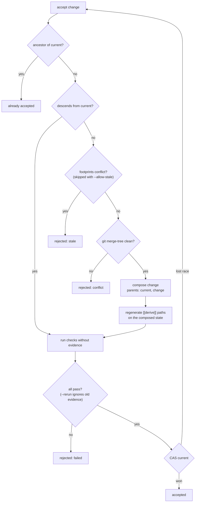

Normative for version 0.1. The reasons behind each part are recorded as architecture decision records (ADR 1 to ADR 14) in the `adr/` folder of the repository. Each rule names the test that enforces it where one exists.

## 1. Objects

### 1.1 State

A git tree object. `state id = tree id`.

### 1.2 Change

A git commit object.

| Commit field | Meaning |
|---|---|
| tree | resulting state |
| parents | changes built on. First parent: the base. Second parent, if any: a change composed in |
| author name | agent |
| message | intent, then the author's account, then trailers |

Trailers, one per line, after the intent:

```text
Zit-Agent: <name>
Zit-Session: <id>          (optional)
Zit-Read: <resource>       (zero or more)
```

The first paragraph of the message is the intent; any further paragraphs before the trailers are the **account**: what the author reported doing and why (`summary`). A commit with no trailers is a valid change: agent = author name, intent = subject, account = body, no declared reads. (`a_plain_git_commit_is_a_change`)

### 1.3 Resource

```text
resource = path            ; whole file
         | path "#" name   ; top-level symbol
         | path "#"        ; module-level code outside symbols
```

The path is everything before the first `#`; in it, a literal `#` is written `%23` and `%` is written `%25`. (`hashes_in_paths_and_names_round_trip`)

Two resources overlap iff they are equal, or one is a whole file and both have the same path.

### 1.4 Evidence

A JSON blob:

```json
{ "check": "ui", "key": "9f2c…", "state": "<tree id>", "passed": true,
  "exit_code": 0, "duration_ms": 412, "output": "<last 4000 bytes>", "at": 1791025806 }
```

`key = sha256(name NUL run NUL inputs)[..16 hex]`, where `inputs` is, for each declared input path in sorted order, `path NUL "<mode> <type> <object id>" NUL` as printed by `git ls-tree`, or `path NUL "-" NUL` if absent. Input paths are normalised first (`./ui/` is `ui`); a path containing `..` is an error. With no declared inputs, `inputs` is the state id. (`input_paths_are_normalised_before_they_are_looked_up`)

## 2. Refs

| Ref | Value | Written by |
|---|---|---|
| `refs/zit/current` | commit | `init`, `accept` |
| `refs/zit/changes/<commit id>` | commit | `record`; deleted by `accept`, `discard` |
| `refs/zit/evidence/<key>` | blob | `check`, `accept` |

**Invariant.** `refs/zit/current` only moves by compare-and-swap from the value the accepting process observed. (`racing_accepts_all_land_exactly_once`)

## 3. Footprint

`footprint(base, tip)`:

1. `git diff-tree -r --no-renames base tip`.
2. For each changed path, index the old and new blob: top-level symbols by name, each with a hash of its text and the set of identifiers it mentions, plus one unit for everything outside symbols.
3. `writes` = symbols whose hash differs, added or removed; `path#` if the outside unit differs; `path` if either side has no grammar, is not UTF-8, is not a regular file, or exceeds 1 MiB.
4. `refs` = identifiers mentioned by the new version of each written unit, excluding the identifier that declares the symbol.
5. `reads` = every `Zit-Read` of the commits in `base..tip`.

`conflicts(mine, theirs)`: for each resource `w` in `theirs.writes`: *write-write* if it overlaps one of `mine.writes`; else *read-write* if it overlaps one of `mine.reads` or is a symbol whose name is in `mine.refs`. Symmetrically, *write-read* for each of `mine.writes` that `theirs` reads and does not write.

Symbol naming:

| Language | Symbols | Folded into their type |
|---|---|---|
| Rust | every top-level `*_item`, `macro_rules!` | `impl` blocks |
| Python | `def`, `class`, decorated definitions, `NAME = …` | methods |
| JavaScript, TypeScript, TSX | function, class, interface, type, enum, `const`/`let`/`var` declarators, and their `export`ed forms | methods |
| Go | `func`, `type`, `const`, `var` | methods, by receiver type |
| Markdown | each heading's section, named by the heading text | — |

Markdown sections have no references. Text before the first heading is `path#`.

## 4. Accept



`footprints conflict` compares `footprint(merge-base, change)` with `footprint(merge-base, current)`, then drops conflicts on paths declared as `[[derive]]` and write-write conflicts on Markdown files. `git merge-tree clean?` ignores conflicts inside `[[derive]]` paths. (ADR 12)

### 4.1 zit.toml

| Key | Meaning |
|---|---|
| `[[check]]` `name`, `run`, `inputs` | a check; see [zit.toml](/checks) |
| `[[derive]]` `path`, `run` | a generated file, rebuilt on compose |
| `[prepare]` `run`, `inputs` | dependency install, run in the cached checkout, keyed by `inputs` |
| `ignore` | extra gitignore patterns for every workspace |

The config is read from the state being acted on: the composed state for `derive` and checks, the materialised state for `prepare` and `ignore`.

## 5. Workspace

Directory `$ZIT_HOME/<repo>-<hash>/ws/<id>/`, described in ADR 5. `record`:

1. `git add -A` and `git write-tree` inside the workspace view.
2. If the tree equals the base state and no compose parent is set: nothing to record.
3. Otherwise create the commit, create `refs/zit/changes/<id>`, and re-base the workspace onto the new change.

`.gitignore` applies: ignored files are not part of the state. (`ignored_files_are_not_part_of_the_state`) So do the user's global excludes, built-in by-product patterns and `zit.toml` `ignore`, through `git/zit-ignore`. (`tool_byproducts_are_never_recorded`)

Materialising: clone the cached checkout of the state (or the newest cached checkout, moved to the state with `read-tree -m -u`, which keeps ignored files). If `[prepare]` is declared and the checkout's `.zit-prepared` key differs, run it; it must leave `diff-files` and untracked files empty. Publish the result to the cache when it is a new state of current, a first checkout, or newly prepared. (`tests/prepare.rs`)

### 5.1 Claims

`claim(workspace, resources)`, under one lock:

1. **Held** = for every other open workspace, its claims and its in-flight writes; for every speculative change, its writes. `[[derive]]` paths are never held. In-flight writes are reused for up to 2 seconds per workspace (`inflight.json`, keyed by base) and computed before the lock.
2. If any requested resource overlaps anything held: refused, nothing recorded, the holders returned.
3. Otherwise the resources are appended to the workspace's `claims` file.

In-flight writes are `footprint(base state, snapshot)`, where the snapshot is taken with a temporary index so the workspace's own index is untouched. (`tests/claims.rs`)

### 5.2 Verification views

`$ZIT_HOME/<repo>/verify/<n>/`, `n` in `0..8`, each guarded by an exclusive lock on `<n>.lock`. Moving a view to a change: `git reset --hard <change>`, `git clean -fd`, empty its `tmp/`. (ADR 10)

## 6. Interfaces

### 6.0 Names

The command is `zit`; `git-zit` is the same program for `git zit …`. Refs are under `refs/zit/`, change trailers are `Zit-Agent`, `Zit-Session`, `Zit-Read`, the config is `zit.toml`, local state is in `$ZIT_HOME` (default `~/.zit`).

### 6.1 CLI exit codes

| Code | Meaning |
|---|---|
| 0 | done |
| 1 | a negative answer: accept rejected, a check failed |
| 2 | an error: not a repository, not initialised, unknown id, bad usage |
| 124 | `zit run --timeout` expired |
| other | `zit run`: the agent's exit code, or `128 + signal` |

Every command accepts `--json`.

### 6.2 Environment

| Variable | Effect |
|---|---|
| `ZIT_HOME` | where workspaces and caches live (default `~/.zit`) |
| `ZIT_GIT` | git binary (default `git`) |
| `ZIT_MATERIALISE=checkout` | disable copy-on-write clones |
| `ZIT_AGENT` | default agent name |
| `ZIT_WORKSPACE` | set by `zit run` for the agent; default workspace for `record`, `read` and `claim` |
| `TMPDIR` | set for agents and checks: a private directory inside the workspace's directory |
| `ZIT_SUMMARY_FILE` | set by `zit run`: where the agent may write its account; otherwise the end of its output is used |
| `ZIT_CACHE_DIR` | set for agents and checks: `$ZIT_HOME/<repo>/shared` |
| `ZIT_TRACE` | print each git call and its duration to stderr (batch read sessions excluded), and workspaces whose edits cannot be seen |
| `ZIT_CHANGE`, `ZIT_STATE` | set for check commands |

### 6.3 MCP tools

`zit_materialise`, `zit_claim`, `zit_read`, `zit_record`, `zit_status`, `zit_show`, `zit_check`, `zit_retry`, `zit_dispose`; with `--integrator`, also `zit_accept` and `zit_discard`. Arguments and results are the CLI's `--json` shapes. A tool failure is a result with `isError: true`; an unknown tool or method is a JSON-RPC error. (`tests/mcp.rs`)

### 6.4 Web view

`zit web` serves, on the loopback interface, to `Host: localhost|127.0.0.1|[::1]` only, `GET` only:

| Path | Returns |
|---|---|
| `/` | the page |
| `/api/graph` | `{repo, current, mainline: [change…], changes: [change + status + fork + wrote…], workspaces: [workspace + dirty + writes + claims + overlaps + fork…]}` |
| `/api/change/<id>` | the `show --json` shape plus `diff` |

(`tests/web.rs`)

### 6.5 Rust library

`cargo doc --open`. The modules are the primitives: `git` (store), `change`, `footprint`, `workspace`, `evidence`, `accept`, plus `api` (the shapes every interface returns), `run`, `mcp`, `tui`.
