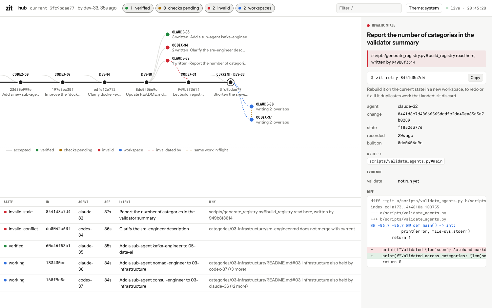
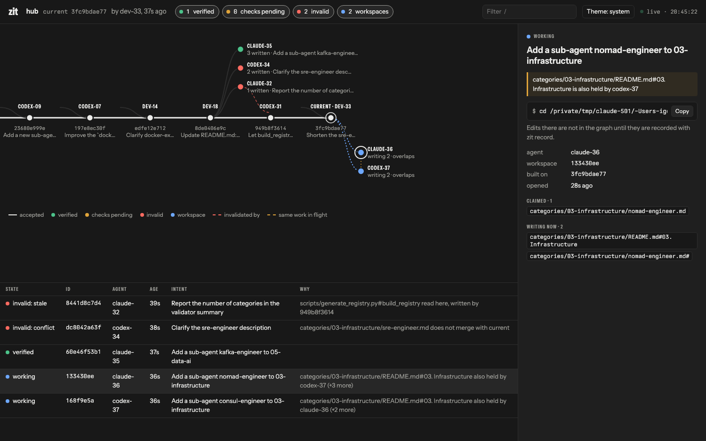

```sh
git zit web            # serves on http://127.0.0.1:4747 and opens the browser
git zit web --port 5000 --no-open
```

Run it in the repository. It refreshes every second and a half, and follows your system's light or dark setting; the header button switches it.





## Reading it

| Element | Meaning |
|---|---|
| The horizontal line | Accepted changes, oldest on the left; the ringed node is current. The label above each node is who made it. |
| A short curve joining the line | That change was composed onto current rather than built directly on it. |
| Nodes above the line | Changes not accepted yet, attached where they left the line. Green: verified. Amber: checks pending. Red: invalid. |
| A dashed red line | From a stale change to the accepted change that invalidated it. |
| Nodes below the line | Open workspaces. Outlined until they hold edits, then filled. |
| A dotted amber line | Two pieces of unaccepted work are writing or claiming the same thing. |
| The table | The same changes and workspaces, with the first reason for each. |

## Using it

- **Select** a node or a row to see the intent, the agent, what was written, every reason it is invalid, the evidence and the diff. For a workspace: what it has claimed, what it is writing right now, and who else is writing the same thing.
- **The next command** for the selection is shown with a copy button: `zit accept …` for a verified change, `zit retry …` for a stale or conflicting one, `zit check … --rerun` for a failed one, `cd …` for a workspace.
- **Filter** with the chips in the header (verified, checks pending, invalid, workspaces) or by typing after `/`: agent, id, intent or file.
- **Keys:** `j` and `k` move through the table, `/` filters, `Esc` clears.
- **Links:** the address bar follows the selection, so `http://127.0.0.1:4747/#443c575da5` opens on that change.

## What it does not do

It is read-only: it answers `GET` only, and only to requests addressed to `localhost`. Accepting, retrying and discarding stay in the CLI and the terminal UI (`zit ui`). It listens on the loopback interface only; if the port is taken, a free one is chosen and printed.

Typography is Autohand Sans and Autohand Mono, served by `zit` itself (SIL Open Font License 1.1).
