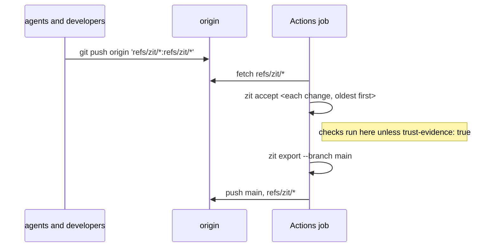

# Zit in GitHub Actions

A composite action that makes a GitHub Actions job the integrator: it installs a released `zit`, fetches the graph (`refs/zit/*`), accepts every change that can land in the order it was recorded, exports the result to a branch and pushes the branch and the graph back.



## Use

[`zit-integrate.yml`](./zit-integrate.yml) is a complete workflow; copy it to `.github/workflows/`. The action itself:

```yaml
- uses: autohandai/getzit/integrations/github@main
  id: zit
  with:
    version: latest        # a release, e.g. 0.1.1
    branch: main           # exported and pushed after accepting
    remote: origin
    trust-evidence: "false"
```

| Input | Default | Meaning |
|---|---|---|
| `version` | `latest` | Release to install from [GitHub releases](https://github.com/autohandai/getzit/releases); the tarball is checked against its published SHA-256. |
| `branch` | `main` | Branch that follows current: `zit export --branch` after accepting, then pushed. |
| `remote` | `origin` | Where `refs/zit/*` is fetched from and pushed to. |
| `trust-evidence` | `false` | `true` sets `zit.trustFetchedEvidence` so evidence pushed with the graph is reused. Off, every check runs on the runner. Turn it on only when everyone who can push `refs/zit/*` is trusted ([ADR 15](../../adr/0015-trust-boundaries.md)). |
| `token` | the job's token | Used only to resolve `latest` through the GitHub API. |

| Output | Meaning |
|---|---|
| `accepted` | Ids of the changes that landed, space-separated. |
| `rejected` | Changes left in the graph, as `id:reason` (`stale`, `conflict`, `failed`), space-separated. |
| `current` | The accepted state after the run, which is also the branch tip. |

The job needs `permissions: contents: write`, a full checkout (`fetch-depth: 0`), and whatever the checks in `zit.toml` need installed. A rejected change does not fail the job: it stays in the graph with its reason, for its author to `zit retry`. The job fails only when a step itself fails (the fetch, the export, the push).

If `refs/zit/current` has not been pushed yet, the first run starts the graph at the branch (`zit init --from origin/<branch>`).

## The pieces

| File | Does |
|---|---|
| [`action.yml`](./action.yml) | The composite action: install, then integrate. |
| [`install.sh`](./install.sh) | Downloads the release for the runner's platform (`aarch64`/`x86_64`, macOS/Linux), verifies the checksum, adds it to `PATH`. |
| [`integrate.sh`](./integrate.sh) | Fetch, trust setting, accept loop, export, push. Needs git, bash and python3. Runs anywhere: `ZIT=/path/to/zit ZIT_BRANCH=main bash integrate.sh` in a clone. |
| [`zit-integrate.yml`](./zit-integrate.yml) | Example workflow: on a schedule and by hand, one run at a time. |

`integrate.sh` is tested in `tests/cli.rs` (`the_github_integrator_script_accepts_fetched_changes_and_publishes_them`) against a local bare origin: a compatible change lands, a stale one is left with its reason, `main` and `refs/zit/current` arrive at origin, and the landed change's ref is removed there. `install.sh` was run by hand against release 0.1.1. The action and workflow have not been run on GitHub Actions.

A push to `refs/zit/*` alone starts no workflow: GitHub runs workflows for branches and tags only. Run on a schedule, by hand, or have the pusher trigger `workflow_dispatch` (`gh workflow run zit-integrate`).
