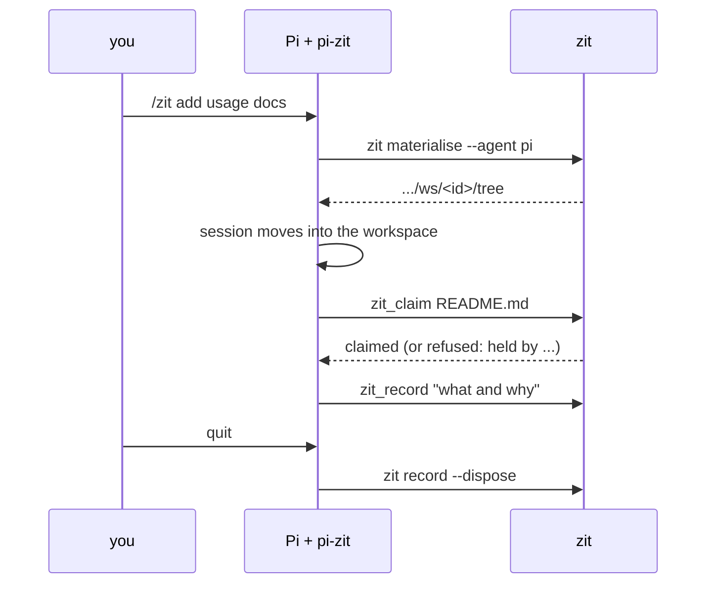

# pi-zit

Zit for the [Pi](https://github.com/earendil-works/pi) coding agent. Pi works in a disposable Zit workspace, claims what it edits so other agents on the same repository do not duplicate it, and its work is recorded as a Zit change with its own account of what it did and why.



## Requirements

- Pi. Tested with 0.84.4.
- The `zit` binary on `PATH`, or `ZIT_BIN` set to it. Without it the tools fail with an install hint.
- A git repository. `/zit` offers to run `zit init` the first time.

## Install

From a checkout of this repository:

```sh
pi install /path/to/getzit/integrations/pi      # all projects (~/.pi/agent/settings.json)
pi -e /path/to/getzit/integrations/pi           # this run only
```

Once published to npm:

```sh
pi install npm:pi-zit
```

`pi install git:github.com/autohandai/getzit` does not work: Pi installs a git repository from its root, and this package lives in `integrations/pi`.

Install it for all projects (the default), not with `-l`. A session started by `/zit` runs in the workspace directory, and Pi reads project settings (`.pi/settings.json`) from there. A project-scoped install is only seen in the workspace if `.pi/settings.json` is committed, names the package by `npm:` rather than by a local path, and the workspace is trusted.

## Use

Three ways into a workspace. In all of them the extension detects the workspace (path `.../ws/<id>/tree` next to a `meta.json`, or `ZIT_WORKSPACE`), turns on the tools below and adds the Zit rules to the system prompt.

**From a session:** `/zit add usage docs`. This creates a workspace and moves the session into it: Pi's tools and `!` commands run there from then on, and your checkout is not touched. With no intent, Pi asks for one.

**From the command line:** `pi --zit "add usage docs"`, which runs `/zit` at startup. Not in print (`-p`) or JSON mode, where the prompt runs before the session can move; there pi-zit prints the alternatives below and does nothing else.

**Without the slash command:**

```sh
cd "$(zit materialise --agent pi --intent "add usage docs")" && pi
```

For headless runs, `zit run --agent pi --intent "..."` runs `pi -p` in a workspace and records it when Pi exits; pi-zit then writes Pi's last reply to `$ZIT_SUMMARY_FILE` so `zit run` keeps it with the change.

### What the model gets

| Tool | Does |
|---|---|
| `zit_claim` | `zit claim` the given resources: `path`, `path#Symbol`, `path#Section heading`. A refusal is a normal result naming who holds what. |
| `zit_status` | `zit status`: current, recorded changes, open workspaces and their claims. Truncated at 2000 lines or 50KB. |
| `zit_record` | `zit record --summary`. The workspace stays open; later edits record as a further change. |

The system prompt says: you are one of several agents; claim before editing; if a claim is refused, pick other work or stop; `zit_status` shows the others; do not commit; finish with `zit_record` and a short summary of what was done and why.

### Commands and flags

| | |
|---|---|
| `/zit [intent]` | Create a workspace and move the session into it. |
| `/zit-status` | Show `zit status`. |
| `/zit-record [summary]` | Record the workspace, delete it, and move the session back to the repository. The summary defaults to Pi's last reply. |
| `/zit-auto-record on\|off` | Whether quitting records the workspace. Saved in the session. |
| `--zit <intent>` | Run `/zit <intent>` at startup. |
| `--zit-no-record` | Never record on quit. So does `PI_ZIT_NO_RECORD=1`. |

### When Pi quits

Inside a workspace, quitting Pi runs `zit record --summary <Pi's last reply> --dispose`: the work becomes a change, the reply (at most 8,000 characters) is stored as its summary, and the workspace is deleted. If nothing changed since the last record, the workspace is just deleted. With auto-record off the workspace is left in place for `zit record` or `zit dispose`. Under `zit run`, pi-zit leaves recording to `zit run`.

Switching session (`/new`, `/resume`, `/fork`) or `/reload` does not record.

## Limits

- `/zit` needs a saved session: it switches to a new session file whose working directory is the workspace. With `--no-session`, use the `cd "$(zit materialise ...)"` form.
- `--zit` hands off to `/zit` asynchronously; a prompt sent in the same instant may still run in the original directory.
- Claims prevent wasted work; they guarantee nothing. What lands is decided when a change is accepted.
- The model's side has not been run end to end yet: on the machine this was built on Pi's model provider key had expired ("API key expired"). Against real Pi 0.84.4 (RPC mode, which drives the same commands as the terminal UI) and the real `zit` binary, without a model turn: `/zit`, `--zit`, the session moving into the workspace, the tools being enabled, the system prompt, `/zit-record`, and recording on quit. The tool handlers are covered by `npm test`.

## Develop

```sh
npm install
npm test          # node:test against the real zit binary in a temp repository
npm run check     # tsc --noEmit
```

Tests use `ZIT_BIN`, defaulting to `../../target/release/zit` (`cargo build --release` at the repository root), and a temporary `ZIT_HOME`.

## Licence

GPL-2.0-only, the same as Zit and git: [LICENSE](LICENSE).
